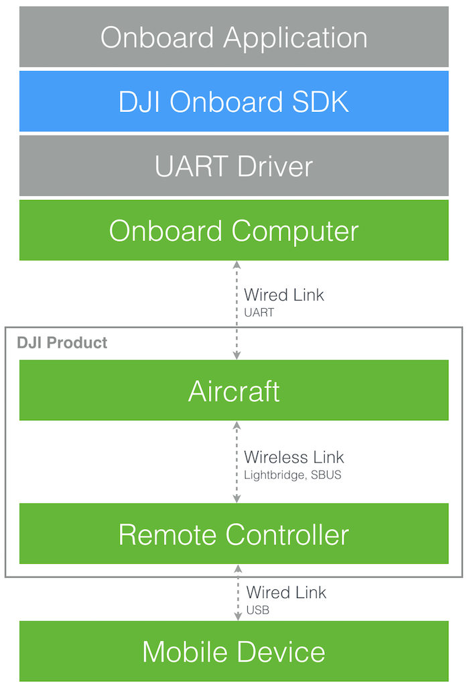

The DJI Onboard SDK is an open source software library that enables computers to communicate directly with a selection of DJI aircraft and flight controllers over a serial interface. The SDK gives access to aircraft telemetry, flight control and other aircraft functions, meaning a developer can use the SDK to load their own compute onboard an aircraft and use it to control flight. 

The SDK includes:

* an open source C++ library that can be used to access DJI aircraft over a serial interface - with support for Linux, ARM and STM32
* TODO ROS?
* closed source library for precision trajectories and collision avoidance
* an aircraft simulator and visualization tool
* sample code and tutorials
* this developer guide and API documentation

## Comparison with Mobile SDK

DJI offers both a Mobile SDK (for Android and iOS) as well as this Onboard SDK (for embedded compute systems). A comparison of the SDKs is below:

Onboard SDK: 
Advantages: 

* High frequency telemetry information and attitude control
* Compute is on the aircraft, not requiring RC

Use:

* Interface with a 

<html>
<table>
<tr>
<td></td>
</tr>
</table>
</html>

## Feature Overview

Many of DJI's product features and capabilities are accessible to developers through the SDK. Developers can automate flight and missions, control the camera and gimbal, and receive real time sensor data. Our SDK designed for you to invent and experiment. We offer a number of modules that integrate with core SDK to provide for precision missions, trajectories, collision avoidance and LiDAR mapping <link here>.

##### Flight Control

The DJI Onboard SDK allows variety of powerful, high-frequency (up to 200 Hz) control modes and missions to control flight:

* **Attitude Control**: controlling the orientation of an aircraft with respect to its center of mass, relative to the horizon. 
* **Velocity Control**: controlling an aircraft using velocity.
* **Position Control**: controlling an aircraft by explicitly setting target position.
* **Missions**: controlling an aircraft via pre-programmed mission API.

##### Camera and Gimbal Control

Handled DJI camera and gimbal can be programmed to take following actions:

* **Take Picture**: in-motion and still image capture.
* **Take Video**: in-motion and still video capture.
* **Gimbal Position Control**: in-motion and still position control.
* **Gimbal Velocitry Control**: in-motion and still velocity control.

##### Hardware Synchronization Control

TODO ...

##### MFIO Control

TODO ...

##### Aircraft Telemetry

Rich sensor data and aircraft state is available through the SDK in real-time (up to 200 Hz):

Inertial Sensor Data

* **GPS**  
* **RTK** 
* **Compass** 
* **Barometer** 

Aircraft Status Data

* **Flight Velocity** 
* **Flight Altitude** 
* **Gimbal Status** 
* **Battery Status** 
* **Qaternion** 
* **Acceleration** 
* **Palstance** 

##### Mobile Communication

While your aircraft can be completely programmed, we also support mobile communication control. It is bidirectional data link between your OES (Onboard Embedded System) and a mobile device developed in conjunction with DJI's Mobile SDK. This link can be established by using the Matrix 100 or Matrix 600 built-in lightbridge communication system or by using a <a href="http://www.dji.com/product/lightbridge-2" target="_blank">Lightbridge 2</a> with the A3/N3.

## Connection to User Application and Aircraft

The following diagram illustrates how the DJI Onboard SDK fits into user application, and how it is connected to a DJI aircraft.

