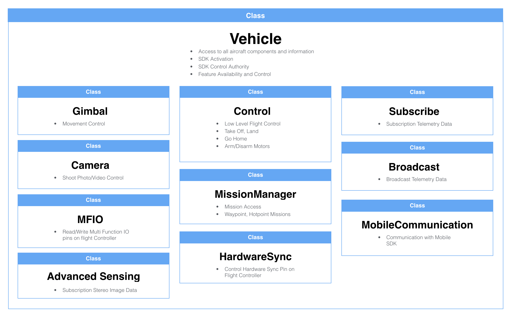

The DJI Onboard SDK includes a core library (OSDK-Core) through which aircraft data and control is obtained. The architecture of this library is designed to be extensible. All commands are product agnostic, and product feature information is available at run-time. This means, when you write an application for one product like the M600, it will also likely work with another product with similar features, like the A3.

## API Hierarchy

An application accesses the DJI product's capabilities through the main Vehicle class in the DJI Onboard SDK. 

The Vehicle class is used to administer the SDK (e.g. SDK activation), and also provides the objects to control and receive state information from the product.
