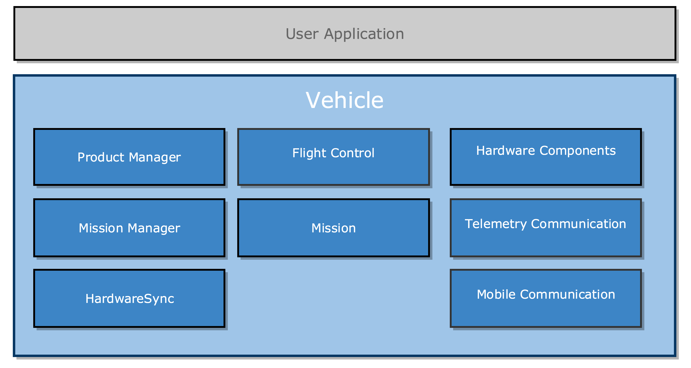

## Introduction

DJI Onboard SDK is an open source communication software library designed to provide developers access to the capabilities of DJI's aircraft, handled camera and sensor products. The software library provides low level control communication between aircraft and computer companion platform (of your choice) mounted directly on aircraft's chasis. This communication allows for onborad, real time processing and can be used to program your aircraft to perform complex missions and tasks.

*Note: If you haven't read the [Quick Start](../quick-start/index.html) guide yet, please do so first.*

## Hierarchy

User application accesses the DJI Onboard SDK through several main classes illustrated in the diagram below.

* **Vehicle**: Main software component class providing entrance to the SDK. It manages activation and encapsulation of hardware and software components.
* **Product Manager**: Software function responsible for component support for various Firmware versions.
* **Flight Control**: Software component providing flight controller features.
* **Hardware Components**: Component classes that describe gimbal, camera, MFIO and flight controller and provide component control.
* **Mission Manager**: Missions are controlled through the mission manager. It provides control of mission preparation, execution, termination, pausing and resumption as well as provides access to the currently executing mission.
* **Mission**: Software Classes that describe different missions such as WayPoint, HotPoint and hold their setup and mission execution properties.
* **Telemetry Communication**: Telemetry software component class providing a way to collect real time data from flight controller.

## Vehicle

A more detailed description of the Vehicle class and its components demonstrating communication API below. The Vehicle holds a number of components which are accessible upon aircraft activation.

Software component class providing handled camera features.
* **Gimbal**: Software component class providing handled gimbal features.
* **MFIO**: Software component class providing handled MFIO features.

### Protocol Layer

* **Protocol Layer**: Software component class implementing transportation layer for DJI OPEN Protocol.

### Driver Layer

* **USART Driver**: Software component class implementing USART protocol communication.

### Hardware Layer

* **Flight Controller**: Hardware component situated on aircraft.
* **Camera**: Hardware component situated on aircraft.
* **Gimbal**: Hardware component situated on aircraft.
* **MFIO**: Hardware I/O component situated on aircraft.

## Vehicle

## Hardware Components

## Mission
