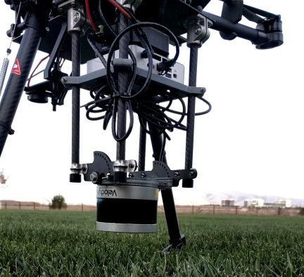

## Introduction

The LiDAR Mapping integration of the Onboard SDK enables users to build a 3-D map of the environment by making use of the pre-existing open source [LOAM package](http://wiki.ros.org/loam_velodyne)
and the [Velodyne PUCK Lite](http://velodynelidar.com/vlp-16-lite.html) LiDAR sensor. 
 
In addition to this, a **pointcloud_las** library enables users to generate maps in an industry standard **LAS** file format. 
 
Mapping can be enabled as a part of the Precision Trajectory or can be run independently. The Mobile OnboardSDK (MOS) iOS app enables users to start or stop Mapping via Precision Trajectory or independently.  


   Aerial Map generated with DJI Matrice 600, Velodyne PUCK Lite running LOAM package and pointcloud_las library. 

### Features

* 3-D mapping integrated as a part of the Precision Trajectory library automatically starts mapping at the start of the spiral and stops mapping
at the end of the spiral by enabling this feature in the mobile app. 
* 3-D mapping can be started and stopped independently during manual fly with the press of a button through the MOS mobile app.
* Automatically logs data in LAS file format by initializing the pointcloud_las library. 
* Can be used in conjunction with [Collision avoidance]. 
* Tested with the DJI Matrice 600. 

### Limitations

* Maps generated are not georeferenced. 
* For the limitations of LOAM Mapping algorithm, please refer to the LOAM [source code](https://github.com/laboshinl/loam_velodyne). 
* In our tests, we noticed: 
  1. Large roll/pith/yaw inputs or translations resulted in scan registration failure and map distortions. 
  2. Lack of rich features also resulted in scan registration failure and map distortions. 

## Software setup

### LiDAR Mapping enabled from Precision Missions.
 
 In order to use the LiDAR Mapping package with Precision Missions:
  
  1. The Linux sample must be compiled with the options
     ```
      -DUSE_PRECISION_MISSIONS=ON -DUSE_POINTCLOUD2LAS=ON
     ```
  2. Source the pointcloud2las setup.bash file
    
     ```
     source build/bin/dji-ros-pointcloud2las/setup.bash --extend
     ```
  3. Lidar Mapping can be enabled in Precision Missions using the tab below in the MOS app.     
    
    
   
   ### LiDAR Mapping enabled Manually
   
 You can run the LiDAR Mapping package manually via the **OnboardSDK-Linux** sample or the **OnboardSDK-ROS** package. 
   
  **via OnboardSDK-Linux**
  
  1. LiDAR Mapping can be manually started by first following steps 1 and 2 under **LiDAR Mapping enabled from Precision Missions**. 
  
  2. Use the button below in the MOS app to enable and disable LiDAR mapping. 
  
   
   
  **via OnboardSDK-ROS**
  
  1. **catkin_make** using the option 
     ```
     -DUSE_POINTCLOUD2LAS=ON
     ```
  2. Source pointcloud2las setup.bash file 
      ```
      source catkin_ws/dji-ros-pointcloud2las/setup.bash --extend
      ```
  3. Use the button below in the MOS app to enable and disable LiDAR mapping. 
        
    
    
  ## Hardware setup
  
   

  
      
     
    
    
 
  
    


 
