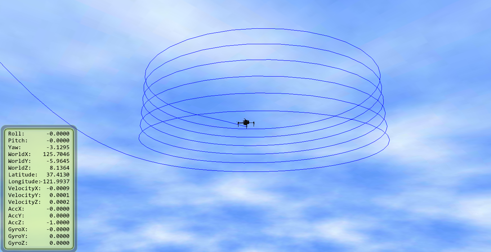
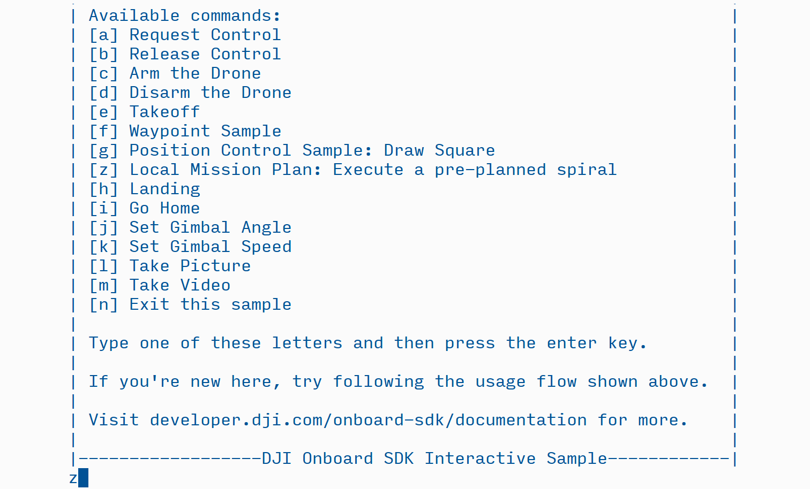
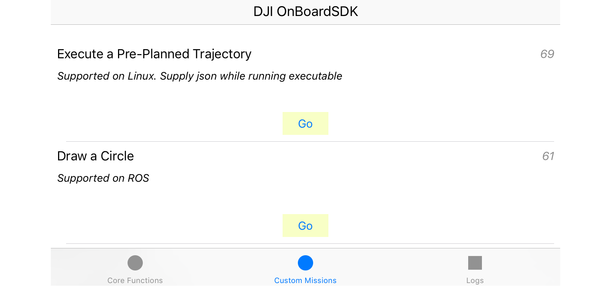
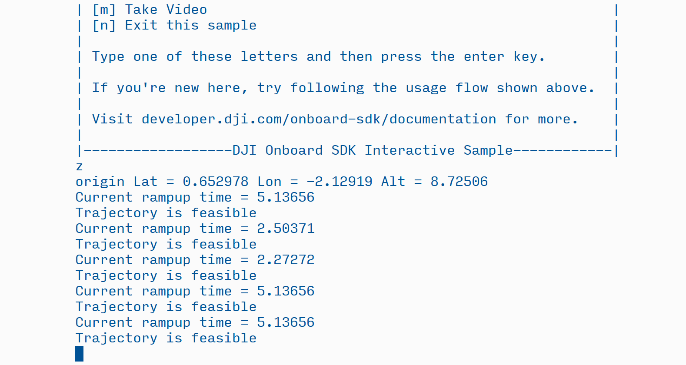

## Introduction

With the Onboard SDK Precision Trajectory Mission Planning suite, DJI developers can now plan complex missions without having to use GPS waypoints. The new DJI Precision Trajectory Mission Planning library has the flexibility to deal with complicated trajectories, issues with GPS accuracy and cases when GPS is simply unavailable. 

For inspection applications like powerlines, towers and buildings, the ability to visualize and plan a smooth, precise trajectory that fully covers the points of interest on your structure can be the difference between actionable data and merely beautiful footage.

The precision trajectory mission planning interface opens up an exciting new paradigm for planning missions - think shapes and actions, not waypoints. Release 3.1.9 of the Onboard SDK provides a beta version of this library that allows you to plan and execute geolocated spiral trajectories around infrastructure.

### Features

* Trajectory following library that can autonomously execute preplanned smooth spiral trajectories
* SketchUp plugin to visualize trajectories, import 3D CAD models and geolocate the scene
* Configurable speed, start/end radii and pitch for the spiral
* Start your drone from anywhere - real-time path planning to get to the trajectory's GPS location 
* Integration with DJI Assistant 2 to visualize simulations of the drone following the trajectory in the SketchUp scene

### Upcoming Features

* We have lots in store for future releases of this suite. As always, we look forward to your feedback.

## Software Setup

1. Follow the build steps in the Linux sample to get CMake to link the sample against the library. No additional configuration is required.
2. Run the executable with `-interactive` or `-mobile` as the first argument.
3. For the trajectory following function, you need to supply a second argument, which is the path to a json file containing trajectory parameters. This path is relative to the location from where you are running the program. E.g.
    ```
    ./djiosdk-linux-sample -interactive ../data/spiral.json
    ```
4. You can generate this json file using the SketchUp plugin as described in the next section.
 
## Workflow

The workflow for using this suite consists of two parts - planning a mission using the DJI Trajectory SketchUp plugin, and supplying the planned mission to the library for execution.

#### 1. Planning a Mission

* Head to the documentation on the [DJI Trajectory SketchUp Plugin](./sketchup.html) to learn how to plan a mission.
* Once you have satisfactorily geolocated and planned a spiral mission, export the json file with the encoded parameters.
* Copy the json to your OES.

#### 2. Simulate the Mission 

* Supply the json you exported above as an argument to the synchronous Linux sample and run the trajectory in simulation. 
* Make sure Assistant 2 is running on the same machine as SketchUp. Using the plugin's `Simulator Connect` feature, you can match up the simulation to ther planned trajectory. 
* In simulation, set up the drone's home position close to the planned trajectory - as you would in real life.
* To run the sample interactively, you can press `[z]` to run the trajectory following for the json supplied at command line. Note that the aircraft needs to have taken off first.

* To run it on mobile, you can go to the `Custom Missions` tab and run the first option. Note that the aircraft needs to have taken off first.

* To run it programmatically, make a call to `startStateBroadcast` and `executeFromParams` in the body of the main function near line 104.

* To integrate this functionality into your own code, take a look at the includes and the linking in the `CMakeLists.txt` in the `./Linux/Blocking` directory. 

On running the trajectory follower, you should see messages telling you about feasibility and rampup times:


#### 3. Fly the mission

* The simulation should give you an idea of the ramp-up curve the drone will execute to reach the spiral, depending on where the take-off point is. Plan to leave that space, and the space around it, empty during your real flight
* You are ready to fly your mission! Take a look at the warnings, caveats and known behavior before you fly outdoors.

## Description of Functionality

* This library uses advanced vehicle control algorithms in local NED-frame coordinates. 
* The parameters of the trajectories are inspected for feasibility. If found to be infeasible, the library suggests a velocity that will make the trajectory feasible. 
* The library also plans an entry trajectory from where the drone is currently located to the start location of the spiral in real-time. This allows you to start the drone at any location close to the spiral.
* You can optionally have the drone take pictures at predefined intervals of time. 
* You can also optionally have the drone record video from the start of the spiral to the end. 


## A Note on the *Beta* Tag

The precision trajectory following suite is fully functional and has been tested in many simulation and real-world scenarios. However, in a complex suite with many variable factors, we cannot at this moment guarantee that it will work as desired in extreme conditions (unreasonable velocities, winds, data corruption, GPS dropout etc). 

This first release is meant to give users an idea of the possibilities that a precision trajectory mission planner opens up. Try out the suite - in simulation before you take it out - and tell us what changes you would like to see!

#### Warnings and Caveats

* **There is no obstacle avoidance** integrated with the path planning. Make sure you plan spirals that stay clear of obstacles or the infrastructure itself. Importing 3D models of the object under inspection into Sketchup and planning around that is a good first-order measure.
* **Leave plenty of open space in all directions in the area between your current location and the planned spiral.** The entry trajectory is planned in real time to provide the smoothest entry into the trajectory such that the entire spiral is executed at constant velocity. This means the entry curve might go wider that you expect in the area leading up to the spiral. The farther you are from the planned spiral, the wider the entry curve - this is to ensure a smooth 'slingshot' maneuver to enter the spiral. This behavior might change in an upcoming release.
* **Do not enter very aggressive parameters in the mission plan**. We safeguard against all the error cases we have encountered but that might not cover the full scope of things that can go wrong in this complex suite. Over time, bug fixes and improved algorithms will help harden the suite.
* **Do not modify the json file by hand.** We take no responsibility for any unwanted behavior caused by editing the json file outside of SketchUp. 

#### Some Notes on Behavior

* Upon starting a ramp-up trajectory, the drone will immediately change its heading to north. This behavior is expected and will be changed in a future release.
* The drone will not execute missions that start below 2m AGL. If you request a lower height, it will automatically change it to 2m.
* MSL altitude is not supported through the mission planning interface and has not been adequately tested. The suite is designed to prefer MSL heights over AGL heights, which will be enabled once we add MSL heights to the planning software; we ask that you do not change the MSL value (-9999) in the json file and instead only plan missions using height above takeoff point.
* Plan to start your drone less than 200m away from the planned spiral. If you start far away, the droe might not execute missions that have too small a starting radius or are too close to the ground because of the way the ramp-up attempts to maintain smoothness.
* If the trajectory at any point gets less than 0.5 m from the ground, the mission is aborted.
* The start angle parameter does not rotate the spiral to the desired angle; it merely enters the first loop of a 0&deg; spiral at the position corresponding to the specified start angle.
* Always, if there are any suspicions that the drone mmight crash, switch out of F mode ([P mode for A3 FW > 1.5.0.0](../appendix/releaseNotes.html#Notes-for-using-Onboard-SDK-with-the-new-a3-v1-5-0-0-fw)) and the drone will stop following.