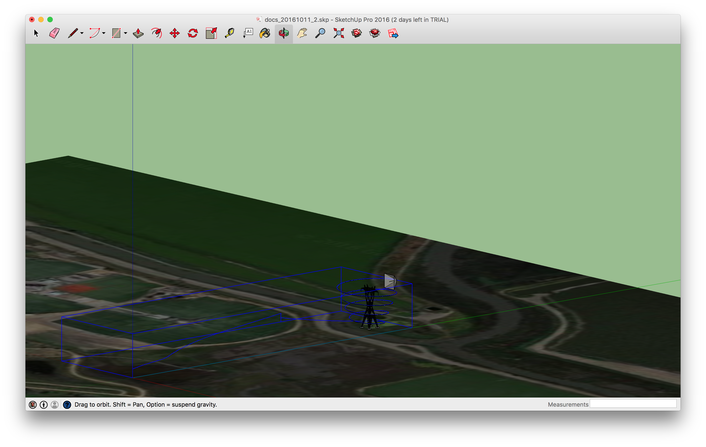
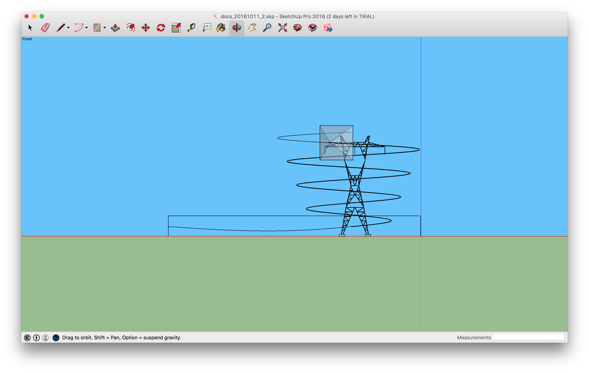

## Introduction

The DJI SketchUp extension for precision trajectory mission planning allows you to plan, visualize, and simulate your
entire mission ahead of time, allowing for rapid iteration and enhanced confidence, safety, and success of the mission.  
Leveraging the built-in functionality of SketchUp, you can create a geo-located model with 2D satellite ground imagery 
corresponding to the location of your mission, import your own 3D models of buildings/infrastructure/etc. that you want 
to inspect or avoid, and integrate with the DJI Assistant simulator to fully test your mission via Onboard SDK, Mobile SDK,
or other app.

### Key Features

* Library of supported trajectory types.  Currently only a helix is supported.
* Integration with DJI Assistant 2 simulator to work with existing test and mission planning workflows.
* Generation of template trajectories and export of their parameters for easy integration with Onboard SDK.

### Menu Items
The extension drop down menu is located at *Extensions->DJI Trajectories*.

* Helix - Opens a window for you to enter the helix parameters.  Once you hit enter or click the OK button, you will be 
able to place the helix in your model.  Enabled when the simulator is not running.
* Export selection - Select a helix trajectory you have previously placed, then click this menu item to export the helix 
properties to a json file.  A menu will popup and let you select where to save the file. 
* Start Simulator - Starts the DJI Assistant simulator and creates a simple aircraft model that will move in sync with 
the aircraft in the simulator.
* Stop Simulator - Stops the DJI assistant simulator.  The trace of the flight is not deleted in case you want to save it.
* Toggle Field of View - Shows or hides the camera field of view during a simulation.
* Camera Properties - Set the camera model field of view properties.  Enabled when the simulator is not running.
    * Horizontal FOV (deg) - Horizontal field of view in degrees of the camera, 0 to 180. 
    * Vertical FOV (deg) - Vertical field of view in degrees of the camera, 0 to 180.
    * FOV distance - Distance to extend the camera field of view, 0m to 100m
    * FOV Alpha - Alpha transparancy of the camera field of view, 0.0 to 1.0
* Simulator Properties - Set the simulator properties.  Enabled when the simulator is not running.
    * Trace enabled - Create a 3D trace of your flight. 
    * Mode - Uses either a smooth or accurate simulation of the flight path.  This is just for the simulation within 
     SketchUp.  The real flight will always be both smooth and accurate.

### Helix parameters

* Start radius - Initial radius.  Can enter using SketchUp units, ie 10.0m .  If units are not entered, defaults to 
model units.  Valid range is 1m to 100m.
* Start at angle - 0&deg; is North, with the helix proceeding East.  If units are not entered, defaults to model units.
* Start height - Initial height.  Can enter using SketchUp units, ie 10.0m .  Must be at least 2m.  If units are not entered, defaults to model units.
* End radius - Initial radius.  Can enter using SketchUp units, ie 10.0m . If units are not entered, defaults to model units.
* Pitch - Change in height per rotation.  Valid range is greater than 0m and less than 50m.  If units are not entered, defaults to model units.  
* No. of rotations - Number of rotations.  Valid range is greter than 0 and less than 100.
* Horizontal speed - Speed traversing the trajectory.  Only used in json export.  Must be greater than 0m/s and less than 10m/s.
When you enter the value use length units as SketchUp doesn't have velocity units.  If units are not entered, defaults to model units.
* Segments per rotation - Number of line segments used to draw each complete rotation.  Only used within SketchUp.
* Take pictures - Whether to take pictures periodically along the trajectory.  Only used in json export.  Valid values are yes or no. 
* Picture interval - Seconds between taking pictures.  Must be at least 1s. 
* Take video - Whether to take video continuously along the trajectory.  Only used in json export.  Valid values are yes or no.

## Software Setup

1. Download and install DJI Assistant 2 (tested with version 1.0.5; download from [here](http://www.dji.com/matrice100/info#downloads)).
2. Download [SketchUp](http://www.sketchup.com/) and install it on your computer
3. Download the extension from [Github](https://github.com/dji-sdk/Onboard-SDK/releases/download/3.1.9/dji_trajectory_v1.0.0.zip) and unzip it.
4. Start SketchUp and then go to the *SketchUp* drop down menu and select the *Preferences* item.  On the left select 
*Extensions*, then click the Install Extension button, select the *rbz* file from the zip file.  
5. Restart SketchUp to be sure plugin is activated and available to use.  Note that SketchUp may appear to freeze 
for a few seconds either after step 2 or after this step while the extension does a one-time initialization.
6. Verify in SketchUp an *Extensions* drop-down menu is visible with a *DJI Trajectories* sub-menu.
 
## Usage

1. Start DJI Assistant 2, connect the aircraft, go to the simulator tab on the left and then click the open button.  
You do not need to start the simulator, the SketchUp extension will start and stop the simulator as needed.
2. Start SketchUp and create a new model.
3. Optionally go to *File->Geo-location->Add location* to geo-reference your model and import ground satellite imagery
4. Import either your own 3D models or models from the SketchUp 3D Warehouse.
5. Create a helix trajectory via *Extensions->DJI Trajectories->Helix*, enter the helix parameters you want, then place
the helix in your model.
6. Export this helix as a json and transfer it to your OES. See [library](README.html#workflow) documentation for more details.
7. Start the simulator via *Extensions->DJI Trajectories->Start simulator*
8. Takeoff and fly via the Onboard SDK, Mobile SDK, manually, or another app. 

### Aircraft Compatibility

The Onboard SDK and Trajectory Library only work with the Matrice 100, Matrice 600, and A3 flight controller.  However,
the SketchUp plugin can also be used with any aircraft that works with DJI Assistant 2.

### Current Limitations

* There is only one shape in the trajectory template library, a left-handed Helix parallel to the ground with ending height
greater than or equal to starting height.
* If you modify the trajectory using the SketchUp tools, ie move, rotate, etc. only the helix center location and 
starting height will be reflected in the exported properties.  The trajectory library only supports a vertical helix, 
so rotating it or stretching it will create a trajectory that will not be followed. 

### Known Issues

* When you have an aircraft following a trajectory, there may be small deviations with the desired trajectory due to issues 
between the DJI Assistant Simulator and SketchUp.  We are working to solve this in a future update.  
