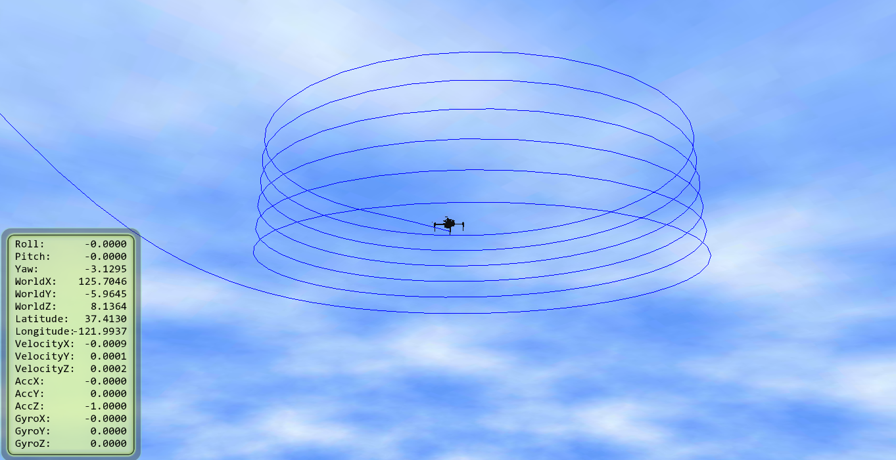
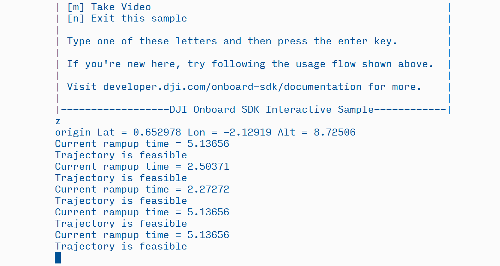

## Introduction

The DJI SketchUp extension for precision trajectory mission planning allows you to plan, visualize, and simulate your
entire mission ahead of time, allowing for rapid iteration and enhanced confidence, safety, and success of the mission.  
Leveraging the built-in functionality of SketchUp you can create a geo-located model with 2D satellite ground imagery 
corresponding to the location of your mission, import your own 3D models of buildings/infrastructure/etc. that you want 
to inspect or avoid.    


With the Onboard SDK Precision Trajectory Mission Planning suite, DJI developers can now plan complex missions without 
having to use GPS waypoints. The new DJI Precision Trajectory Mission Planning library has the flexibility to deal with 
complicated trajectories, issues with GPS accuracy and cases when GPS is simply unavailable. 

For inspection applications like powerlines, towers and buildings, the ability to visualize and plan a smooth, precise 
trajectory that fully covers the points of interest on your structure can be the difference between actionable data and 
merely beautiful footage.

The precision trajectory mission planning interface opens up an exciting new paradigm for planning missions - think 
shapes and actions, not waypoints. Release 3.1.9 of the Onboard SDK provides a first version of this library that 
allows you to plan and execute geolocated spiral trajectories around infrastructure.

### Features

* Trajectory following library that can autonomously execute preplanned smooth spiral trajectories
* SketchUp plugin to visualize trajectories, import 3D CAD models and geolocate the scene
* Configurable speed, start/end radii and pitch for the spiral
* Start your drone from anywhere - real-time path planning to get to the trajectory's GPS location 
* Integration with DJI Assistant 2 to visualize simulations of the drone following the trajectory in the SketchUp scene

### Menu Items
In the Extensions->DJI Trajectories drop down menu

* Helix - Opens a window for you to enter the helix parameters.  Once you hit enter or click the OK button, you will be 
able to place the helix in your model.  Enabled when the simulator is not running.
* Export selection - Select a helix trajectory you have previously placed, then click this menu item to export the helix 
properties to a json file.  A menu will popup and let you select where to save the file. 
* Start Simulator - Starts the DJI Assistant simulator and creates a simple aircraft model that will move in sync with 
the aircraft in the simulator.
* Stop Simulator - Stops the DJI assistant simulator.  The trace of the flight is not deleted in case you want to save it.
* Toggle Field of View - Shows or hides the camera field of view during a simulation.
* Camera Properties - Set the camera model field of view properties.  Enabled when the simulator is not running.
    * Horizontal FOV (deg) - Horizontal field of view in degrees of the camera, 0&deg; to 180&deg; 
    * Vertical FOV (deg) - Vertical field of view in degrees of the camera, 0&deg; to 180&deg;
    * FOV distance - Distance to extend the camera field of view, 0m to 100m
    * FOV Alpha - Alpha transparancy of the camera field of view, 0.0 to 1.0

### Helix parameters

left-handed pitch positive

* Start radius - Initial radius.  Can enter using SketchUp units, ie 10.0m .  If units are not entered, defaults to 
model units.  Valid range is 1m to 100m.
* Start at angle - 0&deg; is North, with the helix proceeding East.  If units are not entered, defaults to model units.
* Start height - Initial height.  Can enter using SketchUp units, ie 10.0m . If units are not entered, defaults to model units.
* End radius - Initial radius.  Can enter using SketchUp units, ie 10.0m . If units are not entered, defaults to model units.
* Pitch - Change in height per rotation.
* No. of rotations - Number of 
* Horizontal speed - Speed traversing the trajectory.  Only used in json export.  Must be greater than 0m/s and less than 10m/s.
When you enter the value use length units.
* Segments per rotation - 
* Take pictures - Whether to take video continuously along the trajectory.  Only used in json export.  Valid values are yes or no. 
* Seconds between - 
* Take video - Whether to take video continuously along the trajectory.  Only used in json export.  Valid values are yes or no.


velocity <= 10m/s
pitch 50m
start height >= 2m
picture >= 1s


### Upcoming Features


## Software Setup

1. Download [SketchUp](http://www.sketchup.com/) and install it on your computer
2. Start SketchUp and then go to the ```Window``` drop down menu and select the ```Extension Warehouse``` item.  In the 
Extension Warehouse window search for DJI and install the extension.
3. Restart SketchUp to be sure plugin is activated and available to use.  Note that SketchUp may appear to freeze 
for a few seconds either after step 2 or after this step while the extension does a one-time initialization.
4. Verify in SketchUp an ```Extensions``` drop-down menu is visible with a ```DJI Trajectories``` sub-menu.
 
## Usage

1. Start DJI Assistant 2 (tested with version 1.0.5; download from [here](http://www.dji.com/matrice100/info#downloads)).
Connect the aircraft, go to the simulator tab on the left and then click the open button.  You do not need to start the simulator,
the SketchUp extension will start and stop the simulator as needed.

1. Start SketchUp and create a new model.
2. Go to ```File->Geo-location->Add location``` to geo-reference your model and import ground satellite imagery.
3. Import either your own 3D models or models from the SketchUp 3D Warehouse.
4. 


* In simulation, set up the drone's home position close to the planned trajectory - as you would in real life.
* To run the sample interactively, you can press `[z]` to run the trajectory following for the json supplied at command line. Note that the aircraft needs to have taken off first.

* To run it on mobile, you can go to the `Custom Missions` tab and run the first option. Note that the aircraft needs to have taken off first.

* To run it programmatically, make a call to `startStateBroadcast` and `executeFromParams` in the body of the main function near line 104.

* To integrate this functionality into your own code, take a look at the includes and the linking in the `CMakeLists.txt` in the `./Linux/Blocking` directory. 

On running the trajectory follower, you should see messages telling you about feasibility and rampup times:


## Description of Functionality

* This library uses fine-grained SE(3) trajectory following in local NED-frame coordinates. 
* The parameters of the spiral are inspected for feasibility. If found to be infeasible, the library suggests a velocity for the radii being demanded.
* A 50Hz-sampled spiral and its derivatives are generated at runtime from the parameters.
* The library also plans an entry trajectory from where the drone is currently located to the start location of the spiral in real-time. This allows you to start the drone at any location close to the spiral.
* You can optionally have the drone take pictures at predefined intervals of time. 
* You can also optionally have the drone record video from the start of the spiral to the end. 

## A Note on the *Beta* Tag

The precision trajectory following suite is fully functional and has been tested in many simulation and real-world scenarios. However, in a complex suite with many variable factors, we cannot at this moment guarantee that it will work as desired in extreme conditions (unreasonable velocities, winds, data corruption, GPS dropout etc). 

This first release is meant to give users an idea of the possibilities that a precision trajectory mission planner opens up. Try out the suite - in simulation before you take it out - and tell us what changes you would like to see!

### Aircraft Compatibility

The Onboard SDK and Trajectory Library only work with the Matrice 100, Matrice 600, and A3 flight controller.  However,
the SketchUp plugin can also be used with any aircraft that works with DJI Assistant 2.

### Current Limitations

1. There is only one shape in the trajectory template library, a left-handed Helix parallel to the ground.
2. If you modify the trajectory using the SketchUp tools, ie move, rotate, etc. only the helix center location and 
starting height will be reflected in the exported properties.  The trajectory library only supports a vertical helix, 
so rotating it or stretching it will create a trajectory that will not be followed. 

### Known Issues

1. When you have an aircraft following a trajectory, there may be small deviations with the target trajectory due to issues 
between the DJI Assistant Simulator and SketchUp.  We are working to solve this in a future update.  

#### Warnings and Caveats

* **There is no obstacle avoidance** integrated with the path planning. Make sure you plan spirals that stay clear of obstacles or the infrastructure itself. Importing 3D models of the object under inspection into Sketchup and planning around that is a good first-order measure.
* **Leave plenty of open space in all directions in the area between your current location and the planned spiral.** The entry trajectory is planned in real time to provide the smoothest entry into the trajectory such that the entire spiral is executed at constant velocity. This means the entry curve might go wider that you expect in the area leading up to the spiral. The farther you are from the planned spiral, the wider the entry curve - this is to ensure a smooth 'slingshot' maneuver to enter the spiral. This behavior might change in an upcoming release.
* **Do not enter unreasonable values in the json file**. We safeguard against all the error cases we have encountered but that might not cover the full scope of things that can go wrong in this complex suite. Over time, bug fixes and improved algorithms will help harden the suite.
