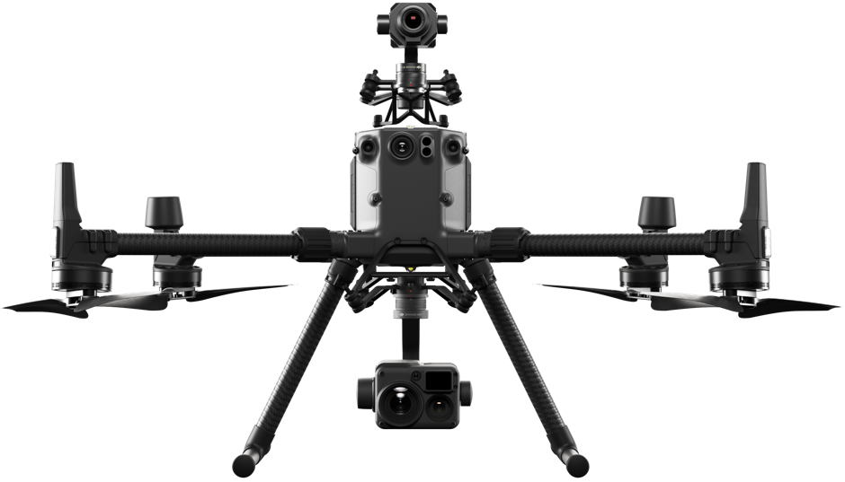

> **NOTE** 
> * This article is **Machine-Translated**. If you have any questions about this article, please send an <a href="mailto:dev@dji.com">E-mail </a>to DJI, we will correct it in time. DJI appreciates your support and attention.
> *  M600 and A3/N3 only support OSDK 3.9 or below; M210 V2 series drones support OSDK 3.9 and above; M300 RTK only support OSDK 4.0 and above.

## Purchase Drones
> **NOTE** The details of the drone please refer to the User's manual.

<table>
  <thead>
    <tr>
      <th style="border: none"></th>
      <th style="border: none; text-align: center"> M300 RTK</th>
      <th style="border: none; text-align: center"> M210 RTK V2</th>
      <th style="border: none; text-align: center"> M210 V2</th>
    </tr>
  </thead>
  <tbody>
    <tr style="text-align: center">
      <td style="border-right: none; text-align: left; border-left: none;"></td>
      <td style="border-left: none;"> 
 
 
      

</td>
      <td style="border-right: none; border-left: none;"> 
 
 
      

</td>
      <td style="border-right: none;"> 
 
 
      

</td>
    </tr>
    <tr style="text-align: center">
      <td style="border-left: none; text-align: left; border-right: none;"> <b> Weight(with battery)</b></td>
      <td style="border-right: none; border-left: none; text-align: center"> 5.3 kg</td>
      <td style="border-right: none;"> 4.91 kg</td>
      <td style="border-right: none;"> 4.8 kg</td>
    </tr>
        <tr style="text-align: center">
      <td style="border-left: none; text-align: left; border-right: none;"> <b> Max Payload</b></td>
      <td style="border-right: none; border-left: none; text-align: center"> 2.7 kg</td>
      <td style="border-right: none;"> 1.23 kg</td>
      <td style="border-right: none;"> 1.34 kg</td>
    </tr>
      <tr style="text-align: center">
      <td style="border-left: none; text-align: left; border-right: none;"> <b> Max Flight Time</b></td>
      <td style="border-right: none; border-left: none; text-align: center"> 55 minutes</td>
      <td style="border-right: none;"> 33 minutes</td>
      <td style="border-right: none;"> 34 minutes</td>
    </tr>
    <tr style="text-align: center">
      <td style="border-left: none; text-align: left; border-right: none;"> <b> Max Payloads</b></td>
      <td style="border-right: none; border-left: none; text-align: center">3</td>
      <td style="border-right: none;"> 2</td>
      <td style="border-right: none;"> 2</td>
    </tr>
    <tr style="text-align: center">
      <td style="border-left: none; text-align: left; border-right: none;"> <b> Visual Perception</b></td>
      <td style="border-right: none; border-left: none; text-align: center"> Six</td>
      <td style="border-right: none; border-left: none; text-align: center"> Three</td>
      <td style="border-right: none; border-left: none; text-align: center"> Three</td>
    </tr>
      <tr style="text-align: center">
      <td style="border-left: none; text-align: left; border-right: none;"> <b> Ingress Protection Rating</b></td>
      <td style="border-right: none; border-left: none; text-align: center"> IP45</td>
      <td style="border-right: none; border-left: none; text-align: center"> IP43</td>
      <td style="border-right: none; border-left: none; text-align: center"> IP43</td>
    </tr>
    <tr style="text-align: center">
      <td style="border-left: none; text-align: left; border-right: none;">   <b> Features</b></td>
      <td style="border-right: none; border-left: none; text-align: center"> Three-paddle Landing   Intelligent Positioning Tracking   Intelligent Patrol   Super Clear Matrix Photo </td>
      <td style="border-right: none; border-left: none; text-align: center"> OcuSync 2.0   RTK Precise Positioning   Data Protection   Automatic Obstacle Avoidance</td>
      <td style="border-right: none; border-left: none; text-align: center"> 8Km Ultra-long-distance Flight   DJI AirSense   Data Protection   Automatic Obstacle Avoidance   </td>
    </tr>
    <tr style="text-align: center">
      <td style="border-left: none; text-align: left; border-right: none;">   <b> SDK Support</b>  （Least Version)</td>
      <td style="border-right: none; border-left: none; text-align: center"> OSDK 4.0.0   PSDK 2.0   MSDK 4.12.0</td>
      <td style="border-right: none; border-left: none; text-align: center"> OSDK 3.9.0   PSDK 1.5.0   MSDK 4.10.0</td>
      <td style="border-right: none; border-left: none; text-align: center"> OSDK 3.9.0   PSDK 1.5.0   MSDK 4.10.0</td>
    </tr>
  </tbody>
</table>

## Purchase computing platforms

#### [Manifold 2-C(See details)](https://www.dji.com/cn/manifold-2?site=brandsite&from=nav)
Uses Intel® Core ™ i7-8550U processor(x86).
  * Weight: about 205 g
  * Memory: 8GB 64 bit, DDR4 2400 MHz
  * SATA-SSD: 256 GB
  * Input and output: USB 3.0 interface(Type A) × 2, USB 3.0 interface(Micro-B) × 1; UART interface x 1

#### [Manifold 2-G(See details)](https://www.dji.com/cn/manifold-2?site=brandsite&from=nav)
Use NVIDIA Jetson TX2 processor(armv8).
  * Weight: about 230 g
  * Memory: 8GB 128 bit, DDR4 1333 MHz
  * eMMC: 32 GB(approximately 28 GB available)
  * SATA-SSD: 128 GB
  * Input and output: USB 3.0 interface(Type A) × 2, USB 3.0 interface(Micro-B) × 1; CAN interface 2, UART interface 2, I2C interface 1, SPI interface UART interface 1

#### Third-party Onboard computer
The following takes the purchase of the STM32 platform as an example to introduce the precautions when purchasing a third-party onboard computer:
* Memory: Support SRAM, 16 Mbit and above
* Interface
    * I2C bus interface, need to be compatible with 64-Kbit EEPROMs, ST MEMSs and I / O expanders
    * Support USB 2.0, with USB-OTG function, support high-speed and full-speed data transmission
    * Power interface: power jack, USB-FS connector, USB-HS connector, through ST-LINK / V2 or daughter board
* Other functions
    * Boot from Flash, system memory or SRAM
    * Four-way control selector with control function
    * Support JTAG and SW Support trace debugging
    * Support ST-LINK / V2
> **NOTE** DJI OSDK uses the STM3241G-EVAL (STM32F417IG) to develop and debug samples. For details, please refer to [STM3241G-EVAL (STM32F417IG) ](https://www.st.com/en/evaluation-tools/stm3241g-eval.html)introduction document.