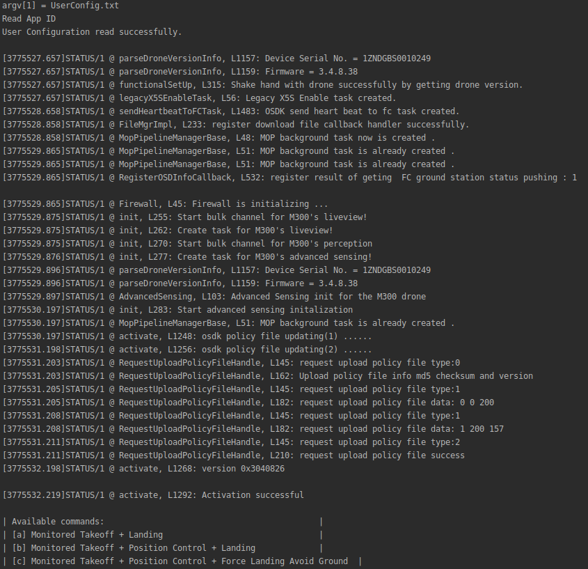
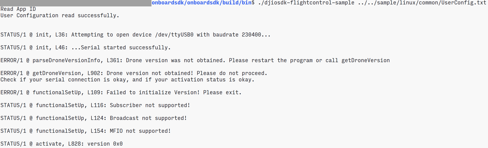

This document takes you through a quick set of steps to see the DJI Onboard SDK in action.

## Register as a DJI Developer

Follow the steps [here](../development-workflow/environment-setup/sample-setup.html#onboard-sdk-application-registration) to register as a DJI Onboard SDK developer, and generate an app ID and key.

## Setup

For this tutorial, you will need :

1. A [compatible](../appendix/versioning.html) DJI vehicle/flight controller
2. An Ubuntu 16.04 PC (virtual machine works as well) to act as your Onboard Embedded System (OES)
3. A Windows/Mac machine to run DJI Assistant 2, required for simulation.

#### 1. Hardware Setup

Follow the steps in the [Hardware Setup Guide](../development-workflow/hardware-setup.html) to connect your DJI device to your Ubuntu PC.

#### 2. Software Setup

Navigate to the [Linux software setup](../development-workflow/environment-setup.html) page to get your software environment ready.

## Build the Flight Control Linux Sample

For this tutorial, we will be running the position control linux sample app with the vehicle/flight controller in simulation mode.

 1. As per the linux software setup guide, make sure you have the cmake build system installed on your machine.
 2. In the `onboardsdk` root directory, run the following commands to build the sample app:
    ```
    mkdir build && cd build
    cmake ..
    make djiosdk-linux-samples
    cd bin
    ```

## Run the sample app

You are now ready to run the sample app! Here's a checklist before you run the app:

 1. You have entered the `sudo usermod -a -G dialout $USER` command, then logged out and logged back in to your account
 1. Vehicle/Flight controller is in simulation mode, connected via USB cable to a computer running DJI Assistant 2
 1. `Enable API Control` is checked on DJI Assistant 2's SDK page
 1. The frequencies at which data is broadcasting on the SDK page are not *all* zero
 1. The baudrate on DJI Assistant 2 matches that in your `config.json` file
 1. App ID and Key have been entered in your `config.json` file
 1. Your hardware setup matches that in the Hardware Setup guide

If all of these are done, proceed to enter the next set of commands inside the `build/bin` directory:
    ```
    ./djiosdk-flightcontrol-sample ../../sample/linux/common/config.json
    ```

You should now see your terminal showing something like this:



Press the `b` key to run a `Takeoff + Position Control Sample + Landing` cycle. You should see the drone doing these in simulation. You are done!

To learn how to write applications like these, go ahead and check out the reference section.

## Troubleshooting

**Q.** The sample app doesn't compile.

**A.** Please make sure you are running Ubuntu 16.04 on an x86_64 machine, and you have an internet connection to download the rapidJSON dependency. If it still doesn't work, raise a GitHub issue.


**Q.** The sample app doesn't show the interactive prompt, instead:
 1. It shows a number of errors
 2. It hangs
 3. It says `Drone version not obtained!`
 4. It looks something like this:
 

**A.** This is usually caused by a connection issue, or a baudrate issue. Please investigate your hardware connections, your baudrate and port name. If it still doesn't work, raise a Github issue.

**Q.** The sample says `Activation failed!` and does not proceed.

**A.** Please make sure you have DJI Go open and your mobile device connected to the internet, and the correct App ID and Key in your `config.json` file. Try a couple of times, if it doesn't work, raise a Github issue.

**Q.** The drone doesn't actually move in simulation, even though the sample suggests it is working correctly.

**A.** Make sure your LightBridge 2 RC is powered on and your battery has enough power left in it. Close the simulation window and open it again (don't hit the Stop Simulation button) to eliminate the possiblity of a visualization issue. Raise a Github issue in case these steps don't work.
