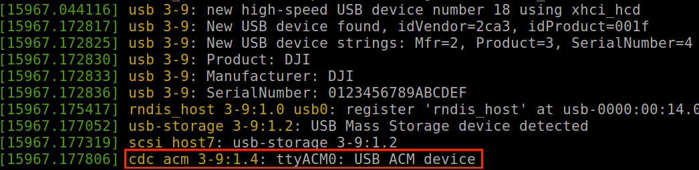

> **NOTE** This article is **Machine-Translated**. If you have any questions about this article, please send an <a href="mailto:dev@dji.com">E-mail </a>to DJI, we will correct it in time. DJI appreciates your support and attention.

This article describes the process of setting up the software environment. After connecting the hardware and setting up the software environment, the developer could create the project and run the sample code.


## Obtion Basic Software

* [DJI Assistant 2](https://www.dji.com/en/downloads)
* [DJI Pilot](https://www.dji.com/en/downloads)
* [Onboard SDK](https://github.com/dji-sdk/Onboard-SDK)
* [Mobile SDK](https://developer.dji.com/user)  （Optional）     

## Configure Linux Development Environment
> **NOTE** The following installation steps take Manifold 2 as an example to introduce the steps to configure the development environment for developing applications using OSDK.

#### 1. Install Development Tools
   * C ++ compiler: GCC 5.4.0/5.5.0 version
   * CMake: 2.8 and above
   * Linux: Ubuntu 16.04 (If you need to use advanced sensor functions, please use the Libusb library)

#### 2. Add UART Permissions
Please follow the steps below to add UART read and write permissions for users specified in Linux:
   1. Use the `sudo usermod -a -G dialout $ USER` command to add the user to the`dialout` group.
   2. After logging in to the added account again, the account can obtain UART read and write permissions.

#### 3. Add DJI USB Device Node
To use the vision function in OSDK on the M210 series of drones to enable the Linux system to obtain and identify DJI devices, please add the DJI USB device node in Linux as follows:
  1. Create the file `DJIDevice.rules` in the`/etc/udev/rules.d/`directory.
  2. Add `SUBSYSTEM=="usb", ATTRS {idVendor} =="2ca3", MODE ="0666"` in the `DJIDevice.rules` file.
  3. After restarting the computer, the system can recognize the DJI USB device.

## Configure ROS Development Environment
> **NOTE** The following installation steps take Manifold 2 as an example to introduce the steps to configure the development environment for developing applications using OSDK.

#### 1. Install Development Tools
* Install C compiler: GCC 5.4.0/5.5.0 version, C ++ 11
* CMake: 2.8.3 and above
* Install toolchain
  ```shell
    mkdir catkin_ws
    cd catkin_ws
    mkdir src
    cd src
    catkin_init_workspace
  ```

#### 2. Install Dependent Software

##### (1) Install DJI Onboard SDK
Obtain the DJI Onboard SDK from [Github](https://github.com/dji-sdk/Onboard-SDK) and install the DJI Onboard SDK using the following command in the DJI Onboard SDK directory.

```c++
 $ mkdir build
 $ cd build
 $ cmake ..
 $ sudo make -j7 install
```

##### (2) Install nema-comms
Use the following command to install nema-comms       
`
$ sudo apt install ros- {release} -nmea-comms
`
> **NOTE** When using Advanced Visual on the ROS, be sure to install nema-comms.

##### (3) Install ACM Driver
After installing the ACM (Abstract Control Model) driver, developers can use an onboard computer or a third-party onboard computer to implement application simulation and external power supply through the USB interface.
Use the `dmesg` command to query the ACM driver information in the system, as shown in Figure 1.
    <div>
<div style ="text-align: center"> <p> Figure 1. Install ACM Driver </p>
</div>
<div style ="text-align: center"> <p> <span>
       </span> </p>
</div> </div>

##### (4) Install FFmpeg
After installing [FFmpeg](http://www.ffmpeg.org), developers can use video onboard computers or third-party onboard computers to implement video-related functions.
Use the following command to install FFmpeg:
```c
sudo apt-get install libavcodec-dev libswresample-dev
```

##### (5) Install OpenCV 3.x
After installing [OpenCV](https://opencv.orgg), developers can use an onboard computer or a third-party onboard computer to visually obtain information on application functions such as stereoscopic perception and object recognition.

#### 3. Add Device Permissions
##### (1) Add UART Permissions
Please follow the steps below to add UART read and write permissions for users specified in Linux:
   1. Use the command `sudo usermod -a -G dialout $ USER` to add the user into the` dialout` group.
   2. After logging in to the added account again, the account can obtain UART read and write permissions.

##### (2) Install LibUSB
* Install LibUSB
After installing LibUSB, developers can use Manifold and third-party onboard computers to obtain image data received by the drone.
Use the following command to install LibUSB: 1.0.17 and later.      
`sudo apt-get install libusb-1.0-0-dev`

* Add DJI USB Device Node
To use the vision function in OSDK on the M210 series of drones to enable the Linux system to obtain and identify DJI devices, please add the DJI USB device node in Linux as follows:
   1. Create the file `DJIDevice.rules` in the`/etc/udev/rules.d/`directory.
   2. Add `SUBSYSTEM =="usb", ATTRS {idVendor} =="2ca3", MODE ="0666"` in the `DJIDevice.rules` file.
   3. After restarting the computer, the system can recognize the DJI USB device.

#### 4. Set The Baud Rate
There are relatively many topics subscribed by ROS by default. In order to ensure sufficient communication bandwidth between ROS and applications developed based on OSDK, the baud rate of UART should be greater than 921600.

> **NOTE**
> * Since the baud rate of Manifold 2-G may deviate slightly from the actual value, please set the baud rate to 1000000. For details, please refer to Manifold 2 <a href ="https://dl.djicdn.com/downloads /manifold-2/20190528/Manifold_2_Production_Information_v1.0_Multi.pdf">Instruction Manual </a>.
> * Only Linux and ROS systems support the use of DJI's advanced vision features.
> * When using the vision function of the DJI drone to implement advanced applications, please add the driver and the third dependency library required by the application.
> * The following installation steps take Manifold 2 as an example to introduce the steps to configure the development environment for developing applications using OSDK.

## Configure The STM32 Development Environment
#### 1. Install Development Tools
  [Keil MDK](http://www2.keil.com/mdk5/) 5.22 and above (armcc 5.06)

#### 2. Using Keil
After activating Keil MDK software, use Keil Pack Installer or <a href="http://www.keil.com/dd2/Pack/"target="_blank"> manual download </a> the latest STM32F4xx_DFP.2.xx Driver package, as shown in Figure 2. Install Pack package.
<div>
<div style ="text-align: center"> <p> Figure 2. Install Pack </p>
</div>
<div style ="text-align: center"> <p> <span>
       </span> </p>
</div> </div>