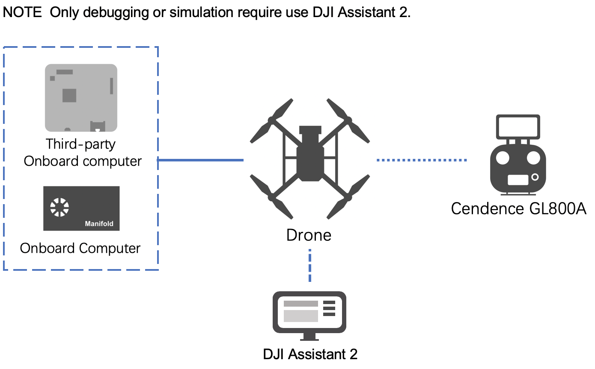
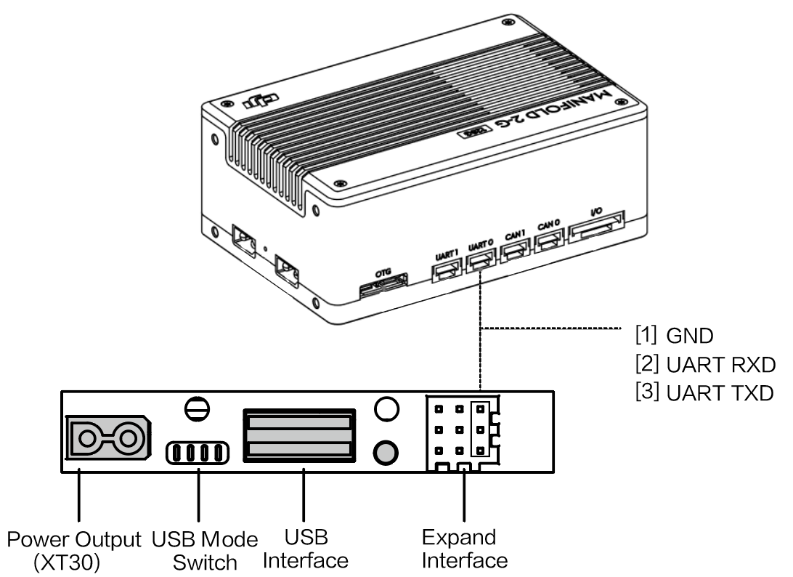
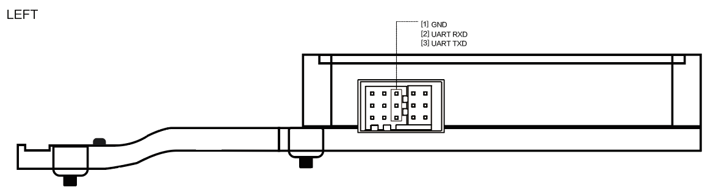
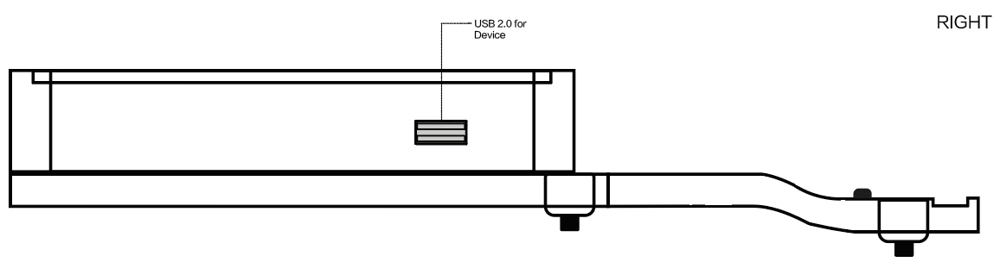
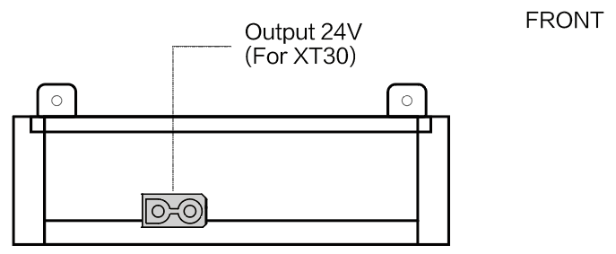
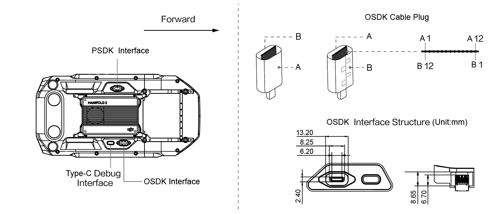

> **NOTE** 
> * This article is **Machine-Translated**. If you have any questions about this article, please send an <a href="mailto:dev@dji.com">E-mail </a>to DJI, we will correct it in time. DJI appreciates your support and attention.
> * Avoiding damage to the device due to improper operation, please refer to the [User's Manual](https://www.dji.comproducts/enterprise?site=brandsite&from=nav#drones) before connecting the onboard computer or a third party onboard computer to DJI's drones.
> * The interface in the illustration of this document is the interface of the **drones**. TheNOTEof the interface in the onboard computer, please refer to [Manifold 2  User's Manual](https://dl.djicdn.com/downloads/manifold-2/20190528/Manifold_2_User_Guide_v1.0_EN.pdf), for the interface of the third-party onboard computer, please refer to the manual of the purchased.
> * Some hardware interfaces that were not described in this document are temporarily unavailable.

Figure 1 display the method of device connection.

 
 Figure1. Device Connection 

 
 
        

 

      

## Using M210 V2 Series
M210 V2 series include M210 V2 and M210 RTK V2. For details, please refer to [User's Manual](https://dl.djicdn.com/downloads/m200_v2/20191213/M200_V2_UM_EN_v1.2_2.pdf).

> **NOTE**
> * The pin identification shown in the figure is the tail of the drone **from top to bottom**. The details for the onboard computer or third-party hardware platform, please refer to the User's Manual of the purchased.
> * If the onboard computer (such as Manifold 2) and the third-party onboard computer triggers the power-off protection mechanism (power-off) of the M210 V2 series due to the higher current (peak current reaches 24V/5A) Or restart frequently), please **disconnect the power output interface (XT30)**, check and adjust the current connection of the onboard computer and the third-party onboard computer, and then reconnect the power output interface.
> * It is recommended to use [Onboard Computer Mounting Bracket](https://store.dji.comproduct/manifold-2-mounting-bracket) to make the safety and reliability of the onboard computer.

#### Connected To Manifold 2
When connecting the onboard computer Manifold 2 to the M210 V2 series, please use the **USB to TTL cable (FT232BL) or use a double-headed USB cable** as shows in Figure 2.

 
 Figure 2. Connect the onboard computer to the M210 V2 series 

 
 
        

 

* Use USB cable      
 Manifold 2 communicates with the drone through **dual-head USB cable**.
* Use the serial cable
     * Method 1: Use the serial cable in Manifold 2 to connect the expansion interface at the rear of the drone and the UART1 interface in Manifold 2 (the device number in Manifold 2 is ttyTHS2);
     * Method 2: Use a USB-to-serial cable to connect the expansion interface at the rear of the aircraft to the USB interface of Manifold 2 (the device number in Manifold 2 is ttyUSBn, n is 0, 1, 2, ...).
* Power Output
    * In order to avoid interference with the normal operation of the drone, please ensure that the voltage of the onboard computer is between 18V and 26V, and the current is constant at 2A;
    * Set the power interface on or off in `utility/bin/` (reset the power switch after the drone restarts);
`./M210ConfigTool --usb-port/dev/ttyACM0 --config-file UserConfig.txt --power-supply on`

> **NOTE** If developer want to use Matrice 210 RTK for time synchronization, please use a cable to connect the SYNC Line interface on Manifold 2 to the PPS and GND pins on the rear of the drone.

#### Connected To Third-Party Onboard Computer
According to the situation of the third-party onboard computer, connect the M210 V2 series to the third-party onboard computer:
* Use the USB cable    
Communicate with the drone through the **dual USB cable**.
* Use the serial cable     
     * Method 1: Connect the expansion interface at the tail of the drone to the UART1 interface of the third-party onboard computer using a serial cable;
     * Method 2: Use a USB-to-serial cable to connect the expansion interface at the rear of the aircraft to the USB interface of a third-party onboard computer.
* Power Output     
When using an external power supply to power a third-party onboard computer, please ensure that it does not interfere with the normal operation of the drone.

> **NOTE** Don't use the VCC pin to power the third-party onboard computer, otherwise the drone or the third-party onboard computer may be damaged.

## Using M300 RTK

> **NOTE**
> * When installing Manifold 2 or a third-party onboard computer on the Matrice 300 RTK, please use the OSDK adapter board.
> * When using a third-party platform as an onboard computer, please avoid generating magnetic fields.

In order to facilitate developers to fix the onboard computer Manifold 2 or a third-party onboard computer on the M300 RTK, DJI provides an onboard computer adapter board, which provides the XT30 24V power port, OSDK serial port and OSDK USB 2.0 port, developers can design the onboard computer adapter board according to the structure and interface of the adapter board. To avoid accidents such as burning the adapter board or onboard computer, please read the following carefully.

#### Adapter Board Interface

> **NOTE** The details for installing the onboard computer adapter board on the M300 RTK, please refer to the [Onboard Computer Adapter Board User's Manual]().

* Communication Interface

 
 Figure 3. Communication Interface 

 
 
        

 

> **NOTE**
> * The USB 2.0 port of the onboard computer adapter board is the USB Device, and the OSDK onboard computer is the Host;
> * When using a serial cable connect the onboard computer and the onboard computer adapter board, the definition of the adapter board interface is the same as the definition of the M210 series;
> * Developers can use the power cord and USB cable to connect the onboard computer and the onboard computer adapter board.

* OSDK USB2.0 Interface

 
 Figure 4. OSDK USB2.0 Interface

 
 
        

 

* Power Output 24V (XT30)

 
 Figure 5. Power Output 24V (XT30) 

 
 
        

 

* Adapter Board Cable Interface

 
 Figure 6. Adapter Board Cable Interface 

 
 
        

 

> **NOTE** Connecting the onboard computer adapter board to the OSDK expansion interface of the M300 RTK, the connection line's side **which has the seam (side B)** needs face to the outside of the drone.

 
 Table 1. Adapter Board Cable Interface 

<table>
<tbody>
<tr>
<th> Side A  </th>
<td> A1 </td>
<td> A2 </td>
<td> A3 </td>
<td> A4 </td>
<td> A5 </td>
<td> A6 </td>
<td> A7 </td>
<td> A8 </td>
<td> A9 </td>
<td> A10 </td>
<td> A11 </td>
<td> A12 </td>
</tr>
<tr>
<th> Name </th>
<td> GND </td>
<td> NC </td>
<td> NC </td>
<td> VCC </td>
<td> UART_RX </td>
<td> DP </td>
<td> DM </td>
<td> UART_TX </td>
<td> VCC </td>
<td> PWM0 </td>
<td> PWM1 </td>
<td> GND </td>
</tr>
<tr>
<th> Side B  </th>
<td> B12 </td>
<td> B11 </td>
<td> B10 </td>
<td> B9 </td>
<td> B8 </td>
<td> B7 </td>
<td> B6 </td>
<td> B5 </td>
<td> B4 </td>
<td> B3 </td>
<td> B2 </td>
<td> B1 </td>
</tr>
<tr>
<th> Name </th>
<td> GND </td>
<td> NC </td>
<td> NC </td>
<td> VCC </td>
<td> ON_DET </td>
<td> RSVD2 </td>
<td> RSVD1 </td>
<td> SYNC (PPS) </td>
<td> VCC </td>
<td> PWM3 </td>
<td> PWM2 </td>
<td> GND </td>
</tr>
</table>

##### Interface Function
* Power Output
    * If you need to power the onboard computer, please use the VCC pin (the rated voltage is 24V 4A, the total power output by the drone is 96w).
    * RSVD1, RSVD2 are reserved pins, RSVD1 pin **must be** floating; RSVD2 pin **must** is GND.
* Data Communication
    * If you want to use the USB 2.0 function, please use the DP and DM pins.
    * If you want to use the PWM signal output by the drone, please use the PWM pin.
    * To use the serial port on the drone to communicate with the onboard computer, please use the UART_RX and UART_TX pins.
        * UART_RX: This pin that receives the drone output signal **through the connecting line** of the onboard computer adapter board, this pin corresponds to the signal output pin TX of the drone OSDK expansion interface.
        * UART_TX: This pin is used to send the signal from the drone to the onboard computer with adapter board, corresponding the receiving pin UART_RX.
* Application Function
     * If you need to use the synchronization signal output by the drone, please use the SYNC (PPS) pin.
     * Using an onboard computer, developer **must** use the ON_DET pin, and the opposite connected to the ON_DET's pin **must** is **GND**.

> **NOTE** After connecting to the onboard computer, please set the baud rate of the OSDK interface on the M300 RTK in Assistant 2.