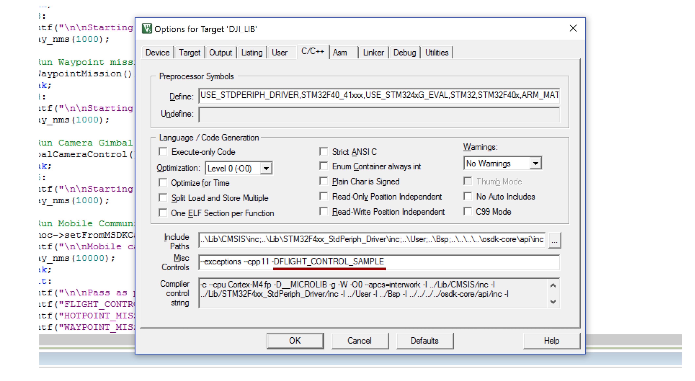

> **NOTE** This article is **Machine-Translated**. If you have any questions about this article, please send an <a href="mailto:dev@dji.com">E-mail </a>to DJI, we will correct it in time. DJI appreciates your support and attention.

After registering the account, please download the [sample](https://github.com/dji-sdk/Onboard-SDK) and supplement the application information, after compiling, debugging and burning, the developer could run the application, With the help of those samples, the developer would know how to develop the application.

> **NOTE** DJI's sample are developed on Manifold 2 and STM3241G-EVAL using Linux and FreeRTOS. If you need to port the sample code to other operating systems or hardware platforms, please refer to [Porting](../quickstart/porting.html).

## Download The Sample
After<a href="https://account.dji.com/login?appId=dji_sdk&backUrl=https%3A%2F%2Fdeveloper.dji.com%2Fuser&locale=en_US" target="_blank"> registered </a> as a developer, you can download the [sample code](https://www.github.com/dji-sdk/Onboard-SDK) provided by DJI. With the help of sample code, you can learn how to use OSDK and developed the application quickly.

## Create The Application
After obtaining the sample code, please create an application in [User Center](https://developer.dji.com/user/apps/#all) and obtain the application ID and application key, as shown in Figure 1.

<div>
<div style="text-align: center"> <p> Figure 1. Fill in the application information </p>
</div>
<div style="text-align: center"> <p> <span>
       </span> </p>
</div> </div>

> **NOTE** To improve your development efficiency, please  fill in *application name*, *ID*, *Key* and *user account* in the sample code **correctly**, otherwise the compiled sample program Will not function properly.

## Parameter Setting
* When the application developed on the ROS platform communicates with the drone through the UART interface, the baud rate should be set to 921600, otherwise packet may loss.
* When using ttyTHS2 on Manifold 2-G to communicate with the drone, please set the baud rate to 1000000. For more details, please refer to Manifold 2 [User Guide](https://dl.djicdn.com/downloads/manifold-2/20190528/Manifold_2_User_Guide_v1.0_CHS.pdf); if you use USB to TTL serial port module to communicate with the drone, it is recommended to use the module which chips is FT232.     
     
## Run The Sample On The Linux
It is recommended to use Ubuntu 16.04 and Manifold 2 to running the Linux sample code.

> **NOTE** The Linux sample code uses Manifold 2-C and also could run on Manifold 2-G.

#### Supplemental Information
Fill the `onboard-sdk/sample/platform/linux/common/UserConfig.txt`:
```c
app_id:          //Developer ID
app_key:         //App Key
device:          //Serial port number
bauderate:       //Serial baud rate
acm_port:        //ACM port number
```

> **NOTE** Developer need to configure `acm_port` when using OSDK 4.0, here default is`/dev/ttyACM0`.


#### Compile
##### 1. Confirm Access Permissions
Before compiling the sample code, please use the `ls -l/dev/xxx` command on the terminal to check the access rights of the serial port (UART interface) of the hardware platform. `Command to gain access to serial device.

> **NOTE** xxx is the name of the serial port.

##### 2. Compile The Sample Code
Enter the directory of the sample code: `onboard-sdk`, and use the following command to compile the sample code into a sample program:
   1. `mkdir build && cd build`;
   2. `cmake ..` or` cmake .. -DADVANCED_SENSING=ON` (use visual function);
   3. `make`;

#### Execute The Sample Program
##### 1. Copy The Configuration File
Copy the configuration file `UserConfig.txt` to the bin file:
`cp ../sample/platform/linux/common/UserConfig.txt bin/
`

##### 2. Enter The Execute Command
The following is execute the "Flight Control": 
`./djiosdk-flightcontrol-sample UserConfig.txt UserConfig.txt`

##### 3. Run The Sample
Enter B from the keyboard to run the sample program

<div>
<div style="text-align: center"> <p> Figure 2. Run The Sample(Linux)</p>
</div>
<div style="text-align: center"> <p> <span>
       </span> </p>
</div> </div>

## Run The Sample On The ROS
#### Compile
##### 1. Create ROS Workspace

```c
  mkdir catkin_ws
  cd catkin_ws
  mkdir src
  cd src
  catkin_init_workspace
```

After using the above command to create a workspace, please copy the OSDK sample code in the `src` directory.

##### 2. Compile The Sample Code
   1. In the `catkin_ws` directory, use the` catkin_make` command to compile the OSDK sample code.
   2. Configure the current workspace `source devel/setup.bash`

#### Execute The Sample Program

##### 1. Supplemental Information
Edit the configuration file `XXXX.launch` and replace the ID, Key, and baud rate of the application.
   * Nodes with 4.0.0:
   `$ rosed dji_osdk_ros dji_vehicle_node.launch`
   * Nodes with 3.8.00:
   `$ rosed dji_osdk_ros dji_sdk_node.launch`
> **NOTE**
> * OSDK ROS 4.0 node configuration file path is `/path/to/catkin_ws/src/Onboard-SDK-ROS/launch/dji_vehicle_node.launch`
> * OSDK ROS 3.8 node configuration file path is `/path/to/catkin_ws/src/Onboard-SDK-ROS/launch/dji_sdk_node.launch` </br>

If you use the dji_sdk_node version 3.8.0, you need to place the `UserConfig.txt`which in the OSDK package to the specified path:
> * If you use the command `rosrun`, the` UserConfig.txt` file needs to be placed to the current running directory;
> * If you use the command `roslaunch`, the` UserConfig.txt` file needs to be placed to the `/home/{user}/. Ros`.

##### 2. Run The Master Node
   * OSDK ROS 4.0.0    
     `roslaunch dji_osdk_ros dji_vehicle_node.launch`
   * OSDK ROS 3.8.0  
     `roslaunch dji_osdk_ros dji_sdk_node.launch`

##### 3. Run The Example Node
* OSDK ROS 4.0.0
  Open a new terminal window, enter the `catkin_ws` directory, and use the following command to configure the workspace (take the Flight Control as an example)
```c
     $ source devel/setup.bash
     $ rosrun dji_osdk_ros flight_control_node
```
   > **NOTE** To use advanced vision features, please run the advanced_sensing_node example program.

* OSDK ROS 3.8.0 (only service and topic are reserved)

## Run The Sample On The STM32
#### Supplemental Information
> **NOTE** The RTOS‘s sample code uses **STM32F407IGH6-EVAL** to develop the application.

1. Use Keil to open the project file `OnBoardSDK_STM32.uvprojx` located in the` sample/platform/STM32/OnBoardSDK_STM32/Project/`.

2. Replace the ID and key of the application in the `OnboardSDK_STM32/User/Activate.cpp`:

```c
void
userActivate()
{
  static char key_buf[65] = "your app_key here";  /*your app_key here*/
  DJI::OSDK::Vehicle::ActivateData user_act_data = {0};
  user_act_data.ID = 0000;    /*your app ID here*/
  user_act_data.encKey = key_buf;
  v->activate(&user_act_data);
}
```

#### Compile
1. Use Keil to open the project file `OnBoardSDK_STM32.uvprojx` located in the` sample/STM32/OnBoardSDK_STM32/Project/`directory.
2. Open the Project tab, select “Options for Target”;
3. In the C/C ++ tab, select the sample code to be compiled, `-DXXXX_XXXXX_XXXXX`.

<div>
<div style="text-align: center"> <p> Figure 3. Run The Sample(STM32)</p>
</div>
<div style="text-align: center"> <p> <span>
       </span> </p>
</div> </div>

#### Execute The Sample Program
   * In the `Project` tab, select` Build Target`
   * Select the Flash-Download option to **burn** the compiled program to the third-party onboard computer (such as STM32F407IGH6-EVAL).

> **NOTE** If you need to debug the sample program, please set the baud rate of the serial debugging tool. The default baud rate of USART3 port is 921600; the default baud rate of USART2 port is 115200.

## Activation And Authorization
When executing the application which develope based on OSDK on the first time, developer need log in the DJI Assistant 2 with developer’s account and obtain the authorization license from DJI's server to activate the application.
* Activate the application: DJI Assistant 2
* Activate troubleshooting
   * Please refer to [Device Connection](./device-connection.html) and connect the drone, the third-party onboard computer; please confirm that the voltage of the UART line is 3.3V.
   * Please check that the devices running DJI GO and other Mobile Apps could access the Internet.
   * Please make sure that the API Control function is enabled in DJI Assistant 2.
   * Please check the application ID, key, developer account and other information in the code with the [User Center](https://developer.dji.com/user/apps/#all) .
   * Please confirm that the baud rate in the application program is correct, the specified driver is installed and the relevant permissions are enabled.