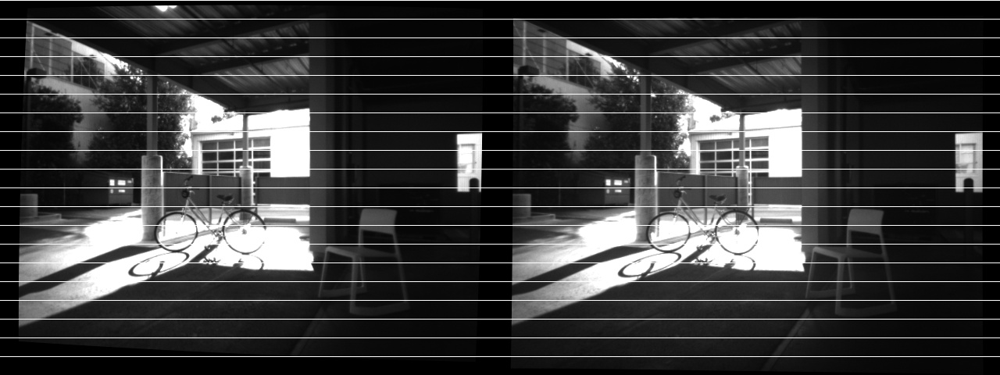
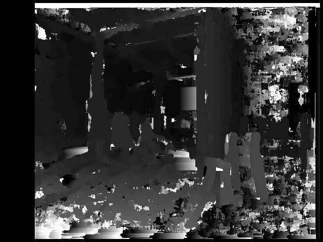
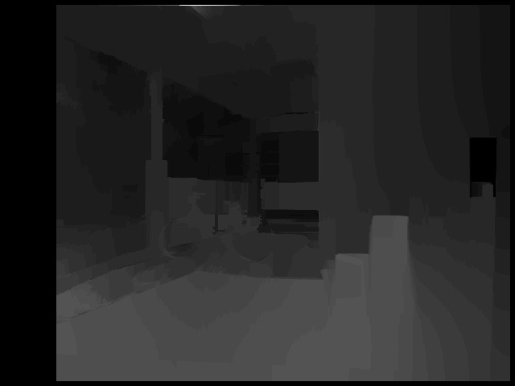
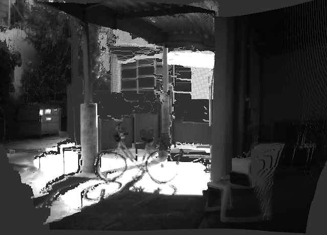

## Introduction
The Advanced Sensing - Stereo depth perception sample demonstrates how to rectify front-facing 
stereo images, calculate disparity map, and unproject 3D point cloud using OpenCV and CUDA. 
The CMakeLists of this sample will detect if developers have OpenCV or CUDA installed 
in their system. OpenCV is required for image processing. CUDA is optional and used for accelerating 
the computation. To have the best user experience, this sample also make use of the [ximgproc](https://github.com/opencv/opencv_contrib/tree/3.3.1) module from OpenCV contrib module to 
[post-filter the disparity map](https://docs.opencv.org/3.1.0/d3/d14/tutorial_ximgproc_disparity_filtering.html).

To avoid compatibility issue between three third-party libraries: OpenCV, OpenCV Contrib, and CUDA, 
we suggest developers to use OpenCV and OpenCV Contrib version 3.3.0+ and CUDA 8+. Please see appendix 
below for instructions on installing these libraries.

To build the samples, follow the steps in [Sample Setup](./sample-setup.html) to build with Advanced Sensing support.

In ROS, an extended sample with object detection is provided, 
please visit [here](./advanced-sensing-object-detection.html#Sample-2-Object-Depth-Perception-in-Stereo-Image) for more information.

## Workflow
Before using this sample, please calibrate your front-facing stereo cameras. 
See appendix below for more information. With the calibrated parameters, 
please modify the `m210_stereo_param.yaml` file located inside the sample folder accordingly. These parameters 
will be parsed by the sample and be used for image rectification, stereo matching 
and point cloud projection.

This sample is built on top of the [multi-thread sample](./advanced-sensing-stereo-images.html#Sample-2-Image-Reading-and-Processing-on-Different-Threads). 
A class `StereoProcessContainer` inherited from `ImageProcessContainer` is provided to store front-facing 
VGA images on the reading thread and to process them on processing thread. Several C++ classes are provided for image
processing:

* Config: a singleton class to parse camera parameters in the yaml file
* PointCloudViewer: a wrapper class for 3D point cloud visualization
* CameraParam: a wrapper class to store camera parameters and their relative position on the stereo rig
* StereoFrame: a class that do all the image processing

To run this sample, please execute the following command:

```
cd build/bin
./stereo-vision-depth-perception-sample UserConfig.txt m210_stereo_param.yaml
```

## Output
This sample provides four incremental steps that will ultimately lead to point cloud projection:
#### 1. Display rectified stereo images
As shown below, images from left and right cameras are concatenated side by side and epipolar lines 
are drawn on the image to visualize the result of rectification.


#### 2. Display disparity map
With rectified stereo images, disparity map can be generated. Here we use OpenCV [StereoBM](https://docs.opencv.org/3.3.0/d9/dba/classcv_1_1StereoBM.html)
API to compute the stereo correspondence. The default disparity range is 64 and the block size is 13.



#### 3. Display filtered disparity map (Optional)
The disparity map generated from block matching algorithm might perform poorly in scene that has
texture-less areas, object occlusions, and depth discontinuities. Here we include the [ximgproc](https://docs.opencv.org/3.3.1/da/d17/group__ximgproc__filters.html)
module in [OpenCV Contrib](https://github.com/opencv/opencv_contrib/tree/3.3.0) to 
post-filter the disparity map. To learn more information about this API, please visit this [page](https://docs.opencv.org/3.1.0/d3/d14/tutorial_ximgproc_disparity_filtering.html).



#### 4. Display point cloud
Finally, with disparity map and camera parameters, we can obtain 3D information of each pixel to 
generate a point cloud. Here we use [Viz3d](https://docs.opencv.org/3.3.0/d6/d32/classcv_1_1viz_1_1Viz3d.html)
module in OpenCV to visualize the point cloud.


#### 5. 3D Object depth perception (Extra)
With the point cloud, we have 3D information of each pixel. Combine this information with 
object detection algorithm, we can obtain the 3D location of the object in 
the image relative to the optical center of the camera. Please visit [object depth perception sample](./advanced-sensing-object-detection.html#Sample-2-Object-Depth-Perception-in-Stereo-Image)
for more information.


#### Appendix. Third-party library Installation
This sample utilizes three libraries to perform image processing. 
Different versions might not be compatible with each other. 
We recommend using `OpenCV 3.3.1`, `OpenCV Contrib 3.3.1`, and `CUDA 9.0`.
<br />


**CUDA 9.0**<br />
Please follow this [page](http://docs.nvidia.com/cuda/cuda-installation-guide-linux/index.html) for detailed instructions.

**OpenCV Contrib 3.3.1**<br />
We first checkout 3.3.1 version, OpenCV core library will include and build it.
```
cd third-party-library-folder
git clone https://github.com/opencv/opencv_contrib.git
cd opencv_contrib
git checkout 3.3.1
```


**OpenCV 3.3.1**<br />
```
cd third-party-library-folder
git clone https://github.com/opencv/opencv.git
cd opencv
git checkout 3.3.1
mkdir build
cd build
```

An example cmake command is shown below, please make according changes.
```
cmake -D CMAKE_BUILD_TYPE=RELEASE \
      -D CMAKE_INSTALL_PREFIX=/usr/local \
      -D INSTALL_C_EXAMPLES=ON \
      -D INSTALL_PYTHON_EXAMPLES=ON \
      -D WITH_TBB=ON \
      -D WITH_V4L=ON \
      -D WITH_QT=ON \
      -D WITH_OPENGL=ON \
      -D WITH_CUDA=ON \
      -D OPENCV_EXTRA_MODULES_PATH=../../opencv_contrib/modules \
      -D BUILD_EXAMPLES=ON ..​
make
make install
```

#### Appendix. Stereo Camera Calibration
There are several libraries online that provide source code and tutorial on how to calibrate 
stereo cameras. Here we lists some of them for developers.

[Camera_calibration package from ROS](http://wiki.ros.org/camera_calibration/Tutorials/StereoCalibration)

[OpenCV calib3d API](https://docs.opencv.org/3.0-beta/modules/calib3d/doc/camera_calibration_and_3d_reconstruction.html#stereocalibrate
) ([Example source code](https://github.com/opencv/opencv/blob/3.3.1/samples/cpp/stereo_calib.cpp))

[Stereo Calibration App from MathWorks](https://www.mathworks.com/help/vision/ug/stereo-camera-calibrator-app.html?s_tid=gn_loc_drop
)