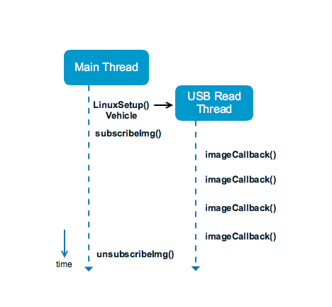

## Introduction
The Advanced Sensing - Stereo Image sample demonstrates how to subscribe and unsubscribe images and to provide custom callback function to display them.
The CMakeLists of this sample will detect if developers have OpenCV installed in their system. If they do, the sample callback function will display the images.

For ROS developers, please use `ROS services` to subscribe the images and `image_view` to display them.

## Before you start

Since Advanced Sensing is a new and additional feature, there are some extra steps for setup:

1. Make sure you follow the [M210 checklist](../M210-Docs/main.html) to setup your M210
2. Provide an extra argument to `cmake` to build Advanced Sensing Library

Instead of 
```
cmake ..
```

Please do
```
cmake .. -DADVANCED_SENSING=ON
```

The rest of the steps are the same as [Sample Setup](./sample-setup.html).


## Workflow
In this sample, the main thread creates a vehicle object with one extra argument to enable this feature and calls an API to subscribe to the images depending on user's input.
The Advanced Sensing feature has a dedicated reading thread to receive image data from the aircraft, developers will be able to access these data by passing a callback function. If developers would like to run intense computation on the image data, it is suggested to create a separate processing thread to avoid interference with the reading thread. 




## Output

As shown below, an onboard computer is attached to M210 running this sample. Stereo images from both forward and downward stereo camera pairs are collected in QVGA resolution (240p) at 20 fps. 


