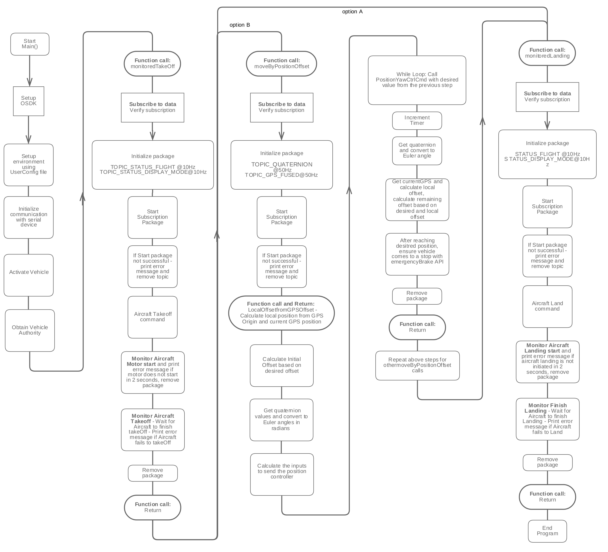
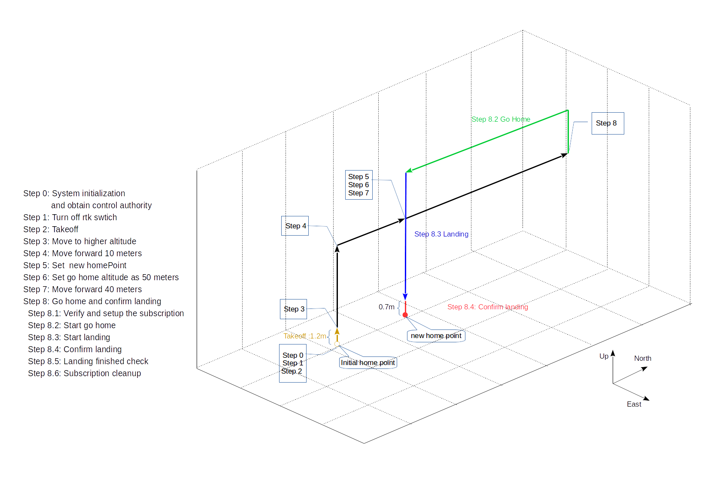

## Introduction 

The flight control sample demonstrates sending control commands to the aircraft using the position control command. The sample allows you to run three operations: 

* Operation 1: Take off and landing aircraft
* Operation 2: Take off, flight motion using position control and land aircraft. 
* Operation 3: Take off, set aircraft parameter or switch go home altitude, flight motion using position control, go home and confirm landing.

**NOTE:** 
        <br>Operation 1 and operation 2 use `Control` class's api, and available on Linux, ROS and STM32. 
        <br>Operation 3 use both `FlightController` and `Control` class's api. In the future, all the api about flight will put in `FlightController` class,
 we will replace `Control` by `FlightController` step by step. Operation 3 only support for M210 series aircraft on Linux.

## Goals 
* Use `Control` or `FlightController`'s basic api for flight action.
* Use subscription's data for close loop control or status judgement.

## Code work flow 
* Operation 2
<br>Operation 2's code workflow is as follow:
[](../images/samples/flightcontrol_flowchart.jpg)
* Operation 3
<br>Operation 3's code workflow is as follow:
[](../images/samples/flight_controller_sample_code_flow.png)
## Code explain
Function `goHomeAndConfirmLanding()` in operation 3 could represent a series of flight actions. It have 6 steps in comment.

* Step 1:<br>Choose the topic use in `topicList[]` and then setup subscription. The function `setUpSubscription()` contains verify, init package, start receive package data.
 Remember to use `teardownSubscription` clean up(reference in step 6) after finished using data.
  ```c++
  /*! Step 1: Verify and setup the subscription */
  const int pkgIndex = 0;
  int freq = 10;
  TopicName topicList[] = {TOPIC_STATUS_FLIGHT, TOPIC_STATUS_DISPLAYMODE,
                           TOPIC_AVOID_DATA, TOPIC_VELOCITY};
  int topicSize = sizeof(topicList) / sizeof(topicList[0]);
  setUpSubscription(vehicle, pkgIndex, freq, topicList, topicSize, timeout);
  ```
* Step 2:<br>Generally, aircraft make an action have 2 parts, it's similar for go home, landing and confirm landing function :
 <br>1 Send command to aircraft, like `startGoHomeSync()`, check the return error code. 
 <br>2 Check the action is started or not, for basic action we can use `VehicleStatus::DisplayMode` to make judgement. If action started, waiting action finished.
  ```c++
  /*! Step 2: Start go home */
  DSTATUS("Start go home action");
  ErrorCode::ErrorCodeType goHomeAck =
      vehicle->flightController->startGoHomeSync(timeout);
  if (goHomeAck != ErrorCode::SysCommonErr::Success) {
    DERROR("Fail to execute go home action!  Error code: %llx\n",goHomeAck);
    return false;
  }
  if (!checkActionStarted(vehicle,
                          VehicleStatus::DisplayMode::MODE_NAVI_GO_HOME)) {
    return false;
  } else {
    while (vehicle->subscribe->getValue<TOPIC_STATUS_DISPLAYMODE>() ==
               VehicleStatus::DisplayMode::MODE_NAVI_GO_HOME &&
           vehicle->subscribe->getValue<TOPIC_STATUS_FLIGHT>() ==
               VehicleStatus::FlightStatus::IN_AIR) {
      sleep(1);  // waiting for this action finished
    }
  }
  DSTATUS("Finished go home action");
  ```
* Step 3:<br>Flight controller will start landing automatically after finished go home action, so it's no need to send landing command.
  When aircraft landing near the ground but the ground is not suitable for landing, it will brake and stop at 0.7m, wait for the user's next command. 
  This is a kind of protection characteristic and details could be found in [guide](https://developer.dji.com/onboard-sdk/documentation/guides/component-guide-flight-control.html#returning-home). 
  ```c++
  /*! Step 3: Start landing */
  DSTATUS("Start landing action");
  if (!checkActionStarted(vehicle,
                          VehicleStatus::DisplayMode::MODE_AUTO_LANDING)) {
    DERROR("Fail to execute Landing action!");
    return false;
  } else {
    while (vehicle->subscribe->getValue<TOPIC_STATUS_DISPLAYMODE>() ==
               VehicleStatus::DisplayMode::MODE_AUTO_LANDING &&
           vehicle->subscribe->getValue<TOPIC_STATUS_FLIGHT>() ==
               VehicleStatus::FlightStatus::IN_AIR) {
      Telemetry::TypeMap<TOPIC_AVOID_DATA>::type avoidData =
          vehicle->subscribe->getValue<TOPIC_AVOID_DATA>();
      sleep(1);
      if ((0.65 < avoidData.down && avoidData.down < 0.75) &&
          (avoidData.downHealth == 1)) {
        break;
      }
    }
  }
  DSTATUS("Finished landing action");
  ```
* Step 4:<br>At the final stage of landing, confirm landing is an useful function to avoid aircraft stay in air. 
  ```c++
  /*! Step 4: Confirm Landing */
  DSTATUS("Start confirm Landing and avoid ground action");
  ErrorCode::ErrorCodeType forceLandingAvoidGroundAck =
      vehicle->flightController->startConfirmLandingSync(timeout);
  if (forceLandingAvoidGroundAck != ErrorCode::SysCommonErr::Success) {
    DERROR(
        "Fail to execute confirm landing avoid ground action! Error code: "
        "%llx\n ",
        forceLandingAvoidGroundAck);
    return false;
  }
  if (!checkActionStarted(vehicle,
                          VehicleStatus::DisplayMode::MODE_AUTO_LANDING)) {
    return false;
  } else {
    while (vehicle->subscribe->getValue<TOPIC_STATUS_DISPLAYMODE>() ==
               VehicleStatus::DisplayMode::MODE_AUTO_LANDING &&
           vehicle->subscribe->getValue<TOPIC_STATUS_FLIGHT>() ==
               VehicleStatus::FlightStatus::IN_AIR) {
      sleep(1);
    }
  }
  DSTATUS("Finished force Landing and avoid ground action");
 ```
* Step 5:<br>After aircraft land on the ground, flight mode will be `MODE_P_GPS` or ` MODE_ATTITUDE` 
  ```c++
  /*! Step 5: Landing finished check*/
  if (vehicle->subscribe->getValue<TOPIC_STATUS_DISPLAYMODE>() !=
          VehicleStatus::DisplayMode::MODE_P_GPS ||
      vehicle->subscribe->getValue<TOPIC_STATUS_DISPLAYMODE>() !=
          VehicleStatus::DisplayMode::MODE_ATTITUDE) {
    DSTATUS("Successful landing!");
  } else {
    DERROR(
        "Landing finished, but the aircraft is in an unexpected mode. "
        "Please connect DJI Assistant.");
    teardownSubscription(vehicle, pkgIndex, timeout);
    return false;
  }

  ```
* Step 6:<br>Function teardownSubscription is used to remove the package of subscription and stop receiving data from aircraft. Remember to use it to clear the package.
  ```c++
  /*! Step 6: Cleanup */
  teardownSubscription(vehicle, pkgIndex, timeout);
  return true;
  ```

## Result
Operation 2's output of the flight control sample in simulation is as shown below. 
[](../images/samples/flight_control_loop.gif)


