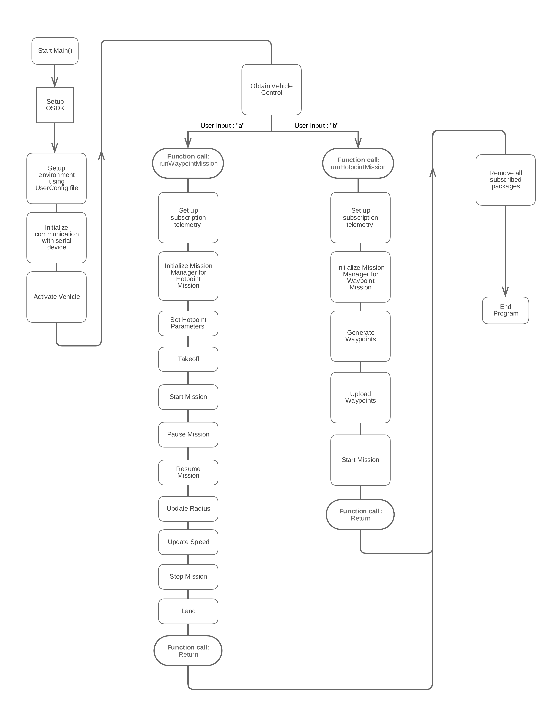

## Introduction

The Missions sample shows example usage of GPS Waypoint missions and GPS Hotpoint Missions.

## Goals

The sample intends to show end-to-end implementation of complete GPS missions. The following examples are available:

1. Waypoint example - This example generates a GPS waypoint polygon around your current GPS location, executes takeoff and then runs the waypoint mission. Some aspects of the mission (speed, heading) are controllable via the DJI Go app.
2. Hotpoint example - This example sets up a Hotpoint (Point of Interest) mission around your current GPS location, executes takeoff ane then runs the mission.  Many aspects of the mission (speed, heading, radius, direction of motion) are controllable via the DJI Go app.

The Missions sample is available on Linux, ROS and STM32.

## Code work flow

## Output

The output of the waypoint mission sample in simulation is shown below, with `wayPointPolygonSides = 5`:

The output of the hotpoint mission sample in simulation is shown below:

