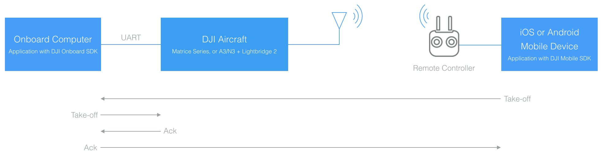
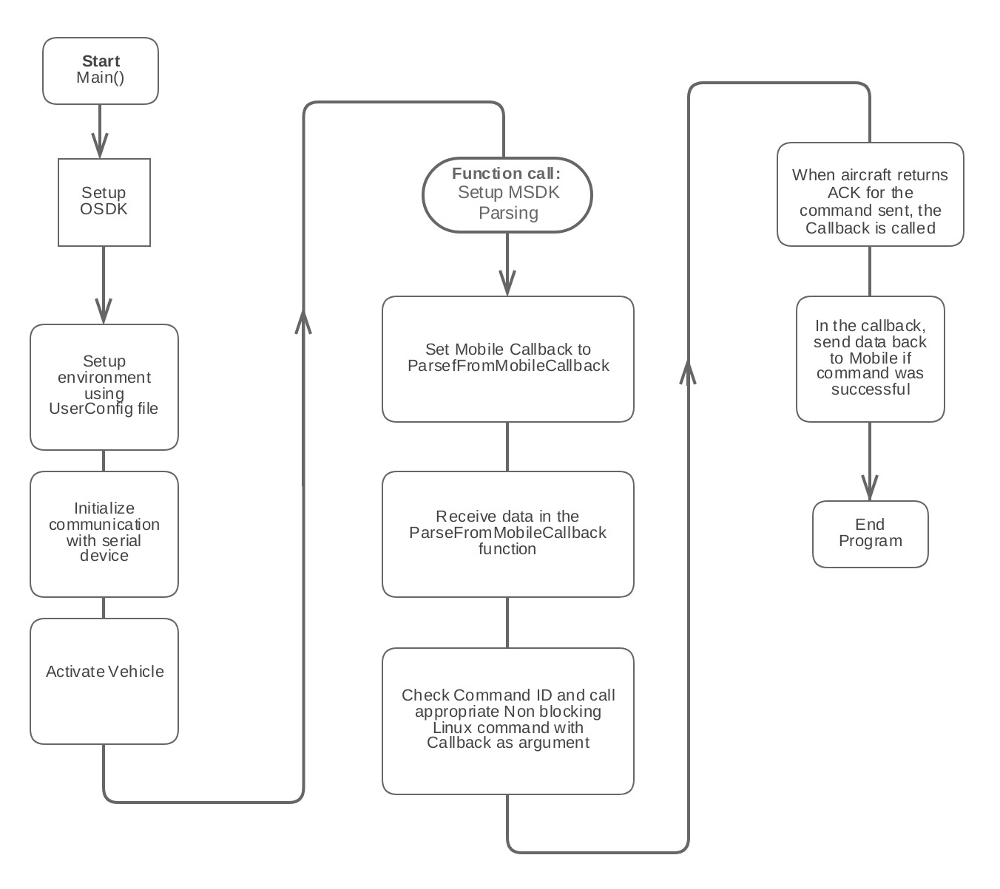

## Introduction

This sample shows how custom data can be sent between a DJI Mobile SDK based application on a mobile device and a DJI Onboard SDK based application on an onboard computer. The data is sent over the Lightbridge wireless communication link between the remote controller and aircraft.

Specifically, this sample sends commands from the mobile device, to the onboard computer and the onboard computer sends acknowledgements back to the mobile device. An example of this data flow is below.

While such a simple example would not be used in a final application (the Mobile SDK can send the take-off command directly to the aircraft already), it is however quite useful during development and testing of an Onboard SDK based application.

The sample can be re-purposed for the developer to interact with the onboard computer through a mobile device while the aircraft is flying. State information can be transferred back to the developer, and the developer can use a modified sample to send different actions to the aircraft which might initiate actions or complicated maneuvers that are being developed.

### iOS Mobile Onboard SDK app

The iOS app can be loaded to a iOS device using Xcode on a Mac OS X system. Below are the list of instructions to load the mobile app to your iOS device. 

- Download Xcode from the App store. 
- Launch Xcode and setup your Apple ID in the Preferences - Account section. 
- Download source for the iOS sample app (MOS) from [here](https://github.com/dji-sdk/Mobile-OSDK-iOS-App)
- Launch the MOS.xcodeproj 
- Click on the 'MOS' project in Xcode to view the General settings. 
- Choose and set a Bundle Identifier for the application

- Use this Bundle Identifier to generate an app key in the DJI developer portal.

- Go to the info.plist of the MOS project and add the entry:
   - _key_: "DJIAppKey"
   - _value_: The app key you received from the DJI developer portal
- Hit Run and let Xcode fix any issues that show up. 
- The app can now be launched on your iOS device. 
- Below is a screenshot of the app after a successful take-off command has been completed. 

The Mobile APIs being used are listed in the [Appendix](./../appendix/mobile-onboard-APIs.html)

## Code work flow

The general execution flow of the sample code is below:

## Feature Support

### Linux 

The supported commands are: 

* Obtain Control
* Release Control  
* Arm
* Disarm 

ACK returned will be displayed on the Mobile app. 

### ROS

The supported commands are:  

* Obtain Control
* Release Control 
* Take Off 
* Land
* Get SDK Version
* Arm
* Disarm 
* Go Home 
* Position Control Demo   
* Waypoint Mission Demo
* Hotpoint Mission Demo

ACK returned will be displayed on the Mobile app.

### STM32

The supported commands are:

* Obtain Control
* Release Control
* Arm
* Disarm

ACK returned will be displayed on the Mobile app.

