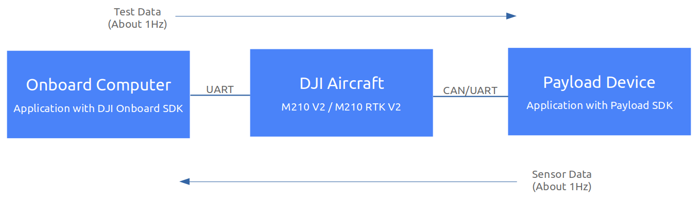
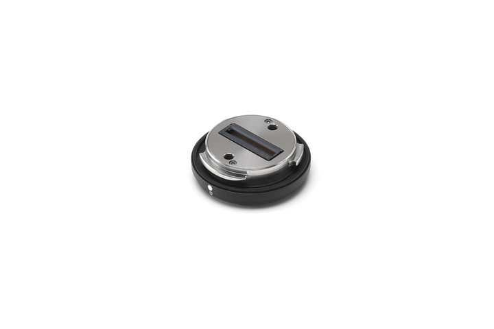
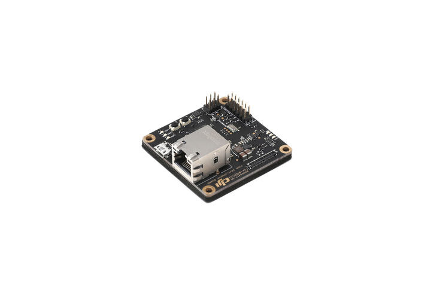
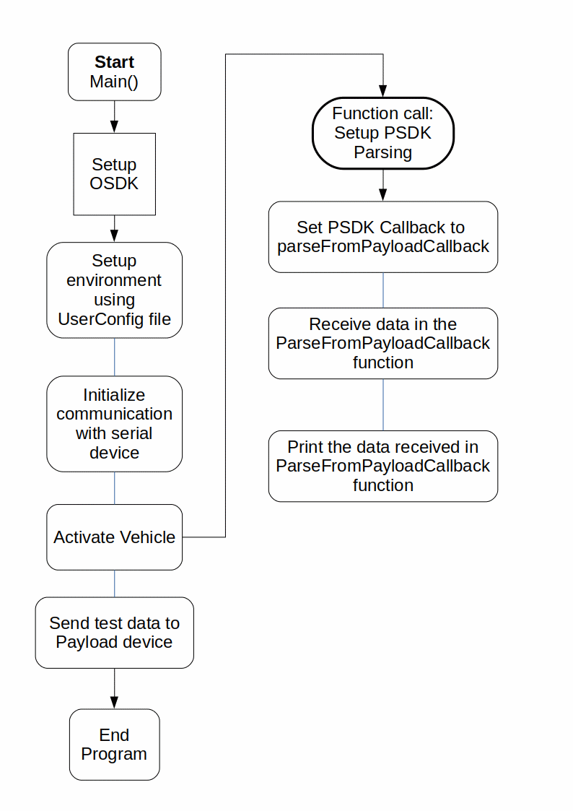
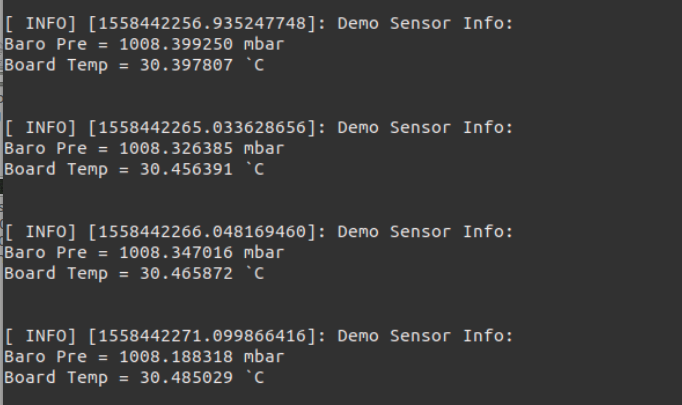

## Introduction

This sample shows how to use the Onboard SDK API on onboard computer to receive the string data from the payload 
device - Payload SDK development board. The data received in this demo include the barometer sensor data and temperture
sensor data. It is pushed at a period of 1Hz.

Besides this, there is also a simple loop code which calls the API to send simple data from onboard computer to payload device.
It simply demonstrates how to use the Onboard SDK interface to send data to Payload SDK.
An example of this data flow is below.

This simple sample only show the basic usage of the APIs about the communication between payload device and onboard computer.
These APIs are mainly for Payload SDK developers. As to how to become a Payload SDK developer and acquire the 
Payload SDK development devices, please click [here](https://developer.dji.com/payload-sdk/).

### Skyport and Payload SDK development board

The Payload SDK development devices from DJI mainly include Skyport and Payload SDK development board.

The Skyport is the standard adapter that secures and integrates a payload onto the aircraft, facilitating communications between these two systems.
A photo of Skyport is below.

The Payload SDK development board helps you explore the Payload SDK features to quickly familiarize yourself with the Payload 
SDK usage and prototype your application during the preliminary R&D phase.
A photo of Payload SDK development board is below.

For more details, please refer to the [Documentation of Payload SDK](https://developer.dji.com/payload-sdk/documentation/introduction/index.html).

## Code work flow

The general execution flow of the sample code is below:

## Output
The output of the Payload SDK communication sample run on ROS is as shown below.

