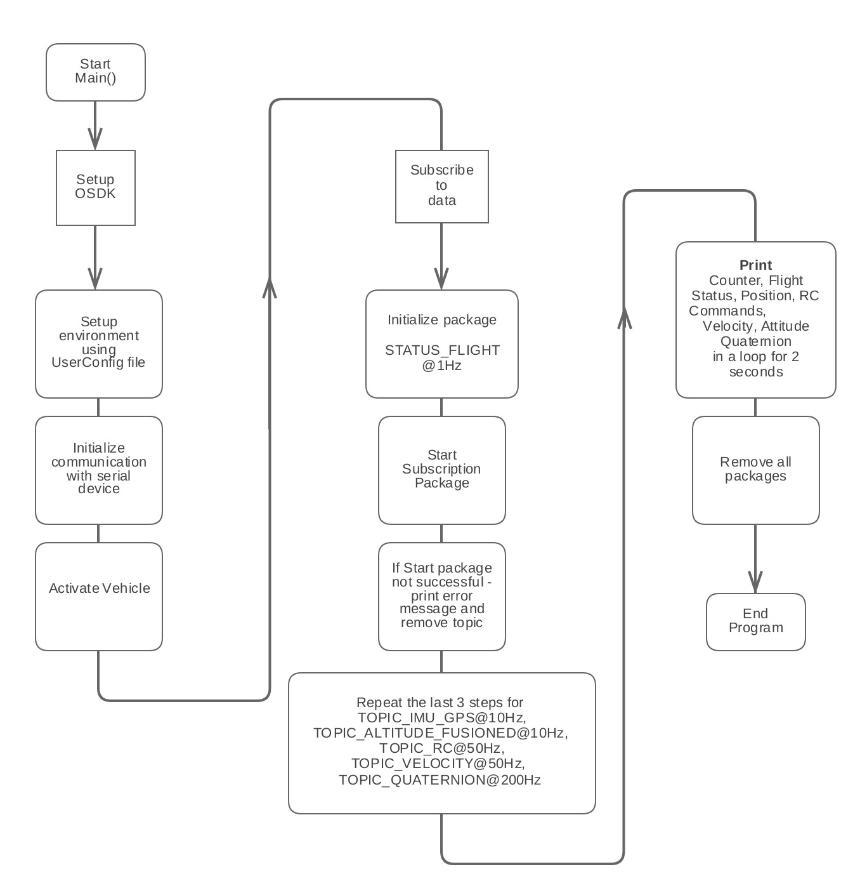
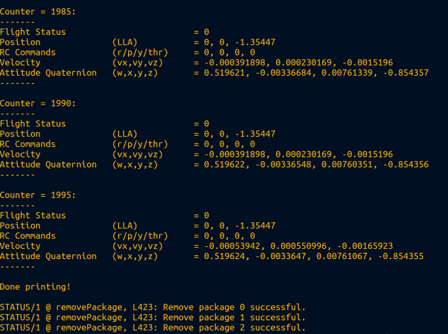

## Introduction 

The Telemetry sample outputs real-time sensor data from the aircraft. Telemetry data may be used for monitoring or logging purposes, sensor data based conditional actions or in control loops.  

## Goals 

The goal of the Telemetry sample is to show users a few examples for the subscription mechanism that will allow users to access real-time sensor data from the aircraft. The sample subscribes to the following sensor data: 
 
1. Flight Status at 1 Hz
2. Fused Lat/Lon at 10Hz
3. Fused Altitude at 10Hz
4. RC Channels at 50 Hz
5. Velocity at 50 Hz
6. Quaternion at 200 Hz

The Telemetry sample is available on Linux and STM32. 

## Code work flow 

## Output 

The output of the telemetry sample is as shown below. 

