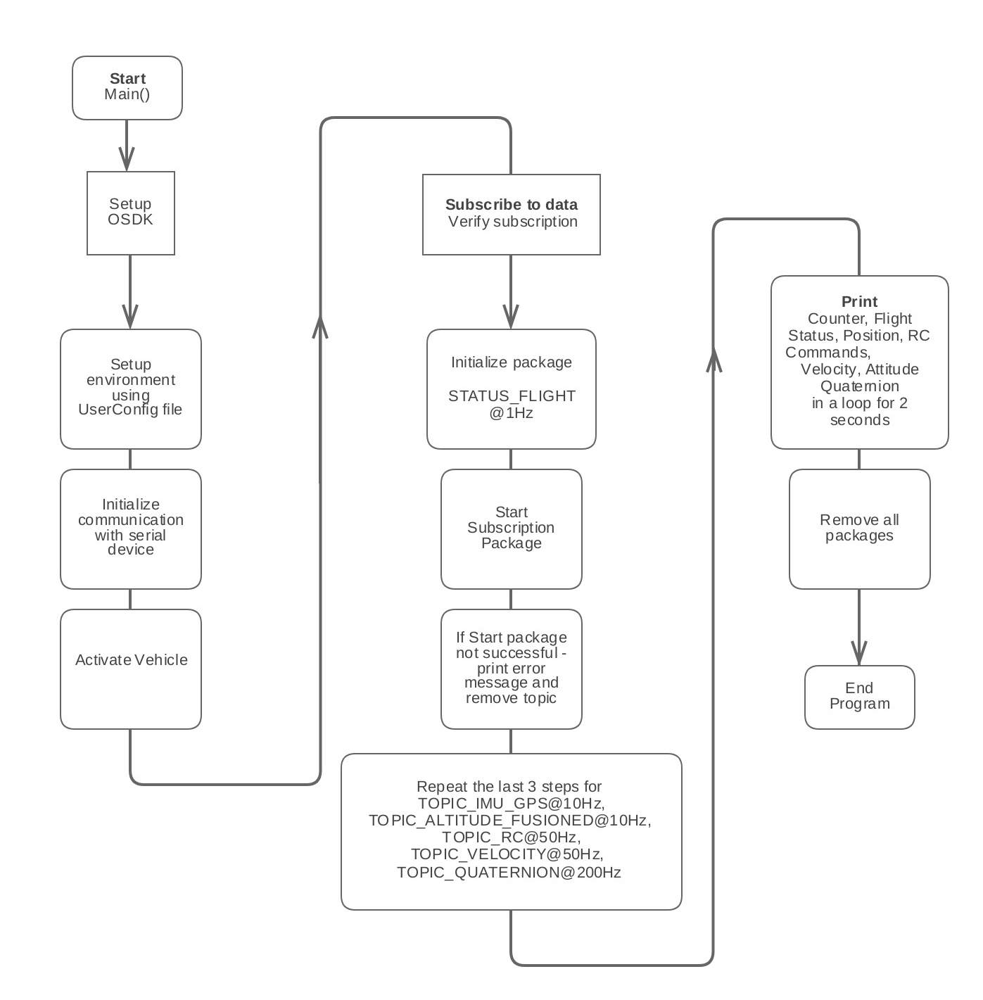

## Introduction 

The Telemetry sample outputs real-time sensor data from the aircraft. Telemetry data may be used for monitoring or logging purposes, sensor data based conditional actions or in control loops.  

## Goals 

The goal of the Telemetry sample is to show users a few examples for the subscription mechanism that will allow users to access real-time sensor data from the aircraft. The sample subscribes to the following sensor data: 
 
Flight Status at 1 Hz
Fused Lat/Lon at 10Hz
Fused Altitude at 10Hz
RC Channels at 50 Hz
Velocity at 50 Hz
Quaternion at 200 Hz

## Code work flow 

## Output 

