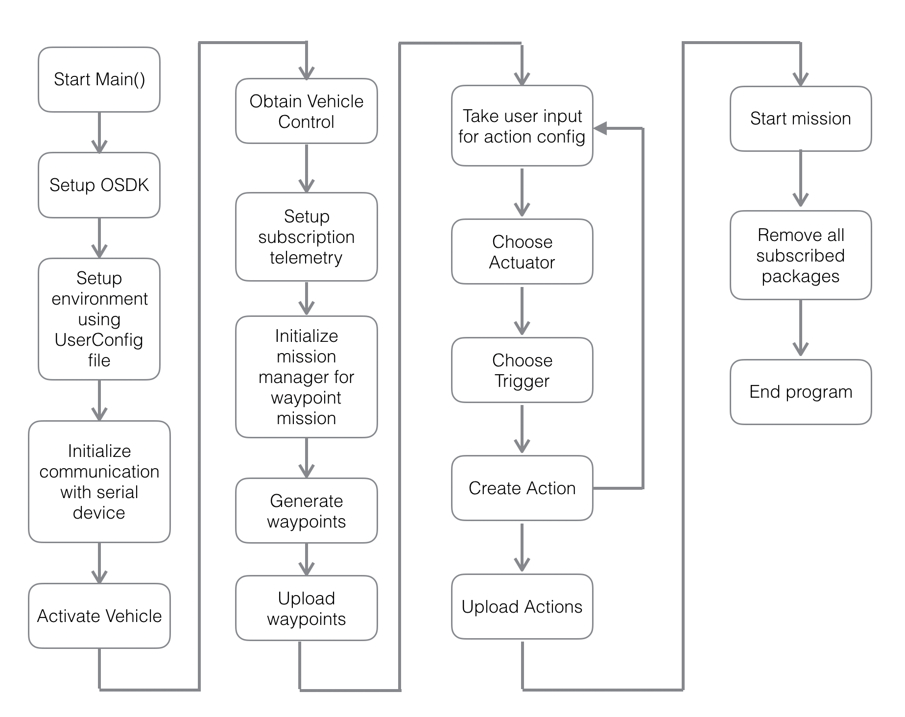

## Introduction

The Missions sample shows example usage of GPS Waypoint missions V2 on M210 V2.

## Goals

The sample intends to show end-to-end implementation of a complete GPS waypoint missions V2. 
It upload 7 waypoints to complete a polygon with 6 sides. 
Then it asks user to mix and match actuators and triggers to upload actions.

The Missions sample is available on Linux. To enable the sample, please add cmake argument `cmake .. -DWAYPT2_CORE=ON`.

## Code work flow

## Output

The output of the waypoint mission v2 sample in simulation is shown below:
- `wayPointPolygonSides = 6`
- `Action actuator: Aircraft Control, yaw 180 deg`
- `Action Trigger: Simple Reach Point at index#2`

