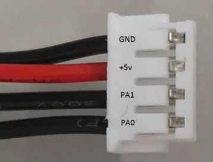
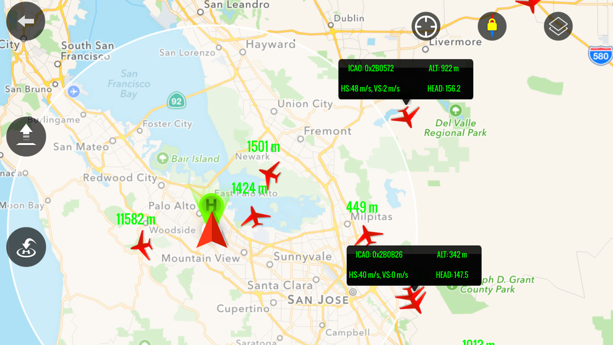
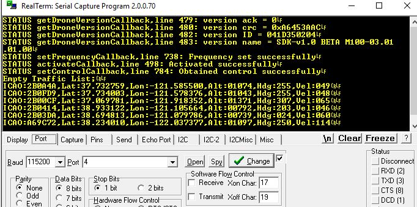

## Introduction

This example demonstrates how to integrate a [pingRX](http://www.uavionix.com/products/pingrx/) ADS-B receiver with the DJI onboard SDK and mobile SDK. 

This small ADS-B receiver allows the drone to receive realtime traffic information broadcasted by other manned or unmanned aircraft, as well as temporary flight restriction (TFR) information brocasted by the goverment. With this type of situation awareness, the onboard embedded system (OES) will be able to make some safety-critical decisions like collision avoidance or self separation.

This example is based on the same hardware and toolchain as the STM32 example released previously, with the addition of a pingRX receiver and the optional (recommended) companion mobile App. The onboard App reads, parses and stores the real time air traffic messages from the ADS-B receiver, and sends the message to the mobile App, which displays the air traffic on a map. The onboard App also prints the air traffic information to a connected computer through UART.

Before using this example App, make sure you have followed the [Quick Start](../../quick-start/index.html), the [STM32 example](../../github-platform-docs/STM32/README.html), and have valid `APP KEY` and `APP ID`.

## Setup

### 1. Hardware Installation

We assume the user of this App has gone through the STM32 example, and has an pingRX ADS-B receiver. In addition, if the user wants to display the air traffic on the mobile App, an iPhone or iPad is needed, since at this moment, the mobile App only supports iOS.

Follow the [hardware installation documentation of the STM32 example](../../github-platform-docs/STM32/README.html#setup) to connect the STM32 board to the PC (USART2) and to the flight controller (USART3). In addition, this example requires the pingRX to be connected to UART4 port and powered by the board

.

### 2. Build the example APP

First, clone the source code of the example app with its submodules using git:
> git clone --recursive https://github.com/dji-sdk/Onboard-SDK.git

Open the project located in `thirdparty/ADSBExample/Stm32PingExample/ProjectKeil/Stm32PingExample.uvprojx` in Keil uVision IDE. To build the code, developers need to replace the `APP_KEY` and `APP_ID` obtained from DJI Developer site in `thirdparty/ADSBExample/Stm32PingExample/inc/AppKey.h` file.

Use the menu item `Project->Build Target` and `Flash->Download` to build the project and flash to the STM32 board.

### 3. Configure the serial terminal software

Configure your serial terminal software following the STM32 example documentation, with baud rate **115200**.

### 4. Build the mobile App

The iOS App is located in a separate repo named `OnboardSDK-Ping-iOSApp`. Obtain the the source code of the using git:
> git clone --recursive https://github.com/dji-sdk/OnboardSDK-Ping-iOSApp.git

Then follow the documentation in the repo to build and sideload the mobile App to your iOS device. You should see a new App named `Ping Demo` on your iOS device.

## Activation

The fireware activates the drone automatically after reset. Make sure the drone and the remote controller is powered before resetting the STM32. 

## Operation

### 1. View the air traffic on mobile App

Connect the iOS device to the remote controller, power on both the drone and the RC and reset the STM board. Open the `Ping Demo` App. If there is air traffic in your area, you should see red airplanes on the map.

.

### 2. View the air traffic data on computer

The onboard App also print the traffic data as well as the debug information to USART2 port, which can be viewed from the serial terminal from a computer.
.

