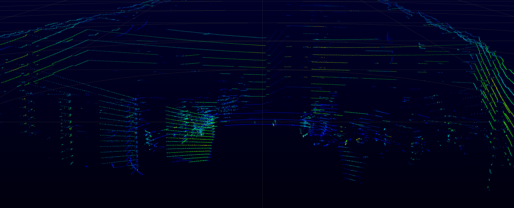
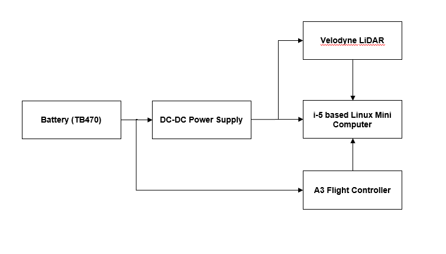
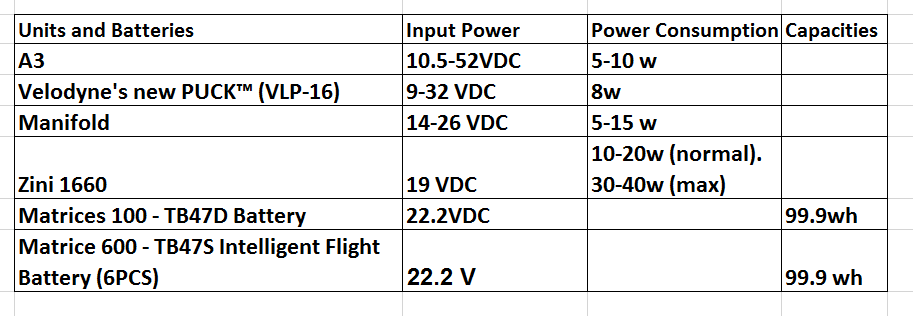
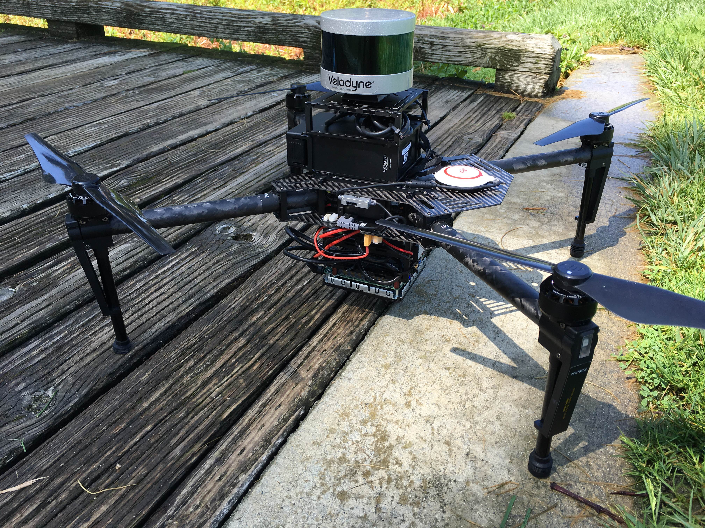
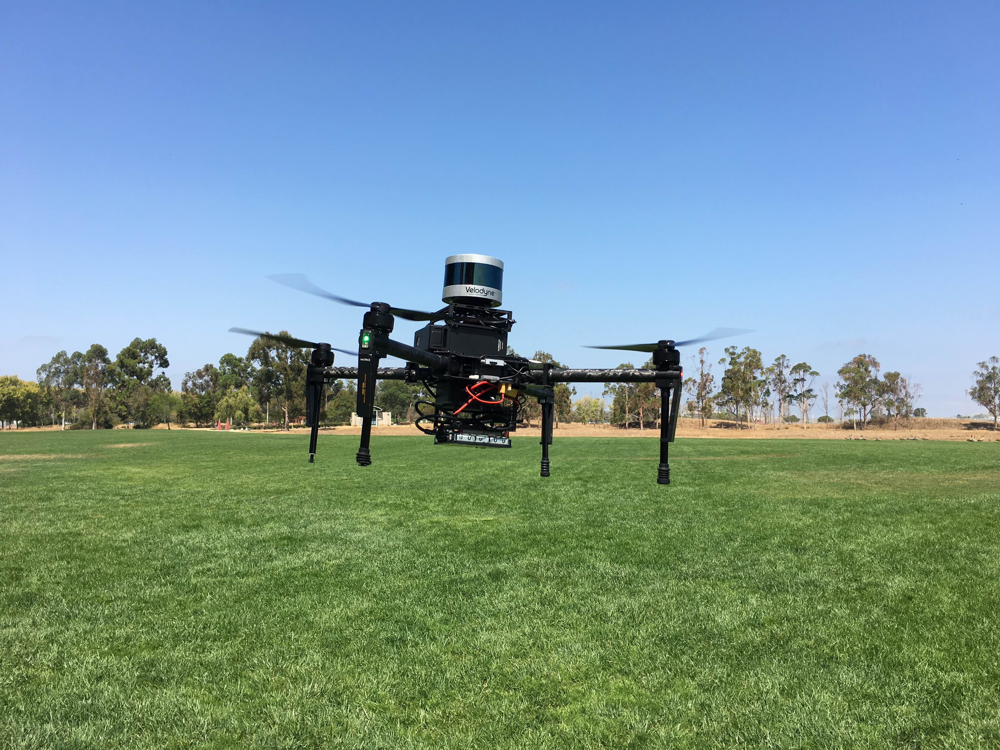
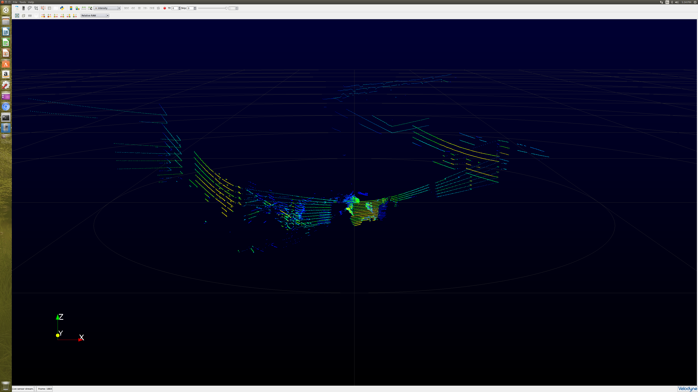
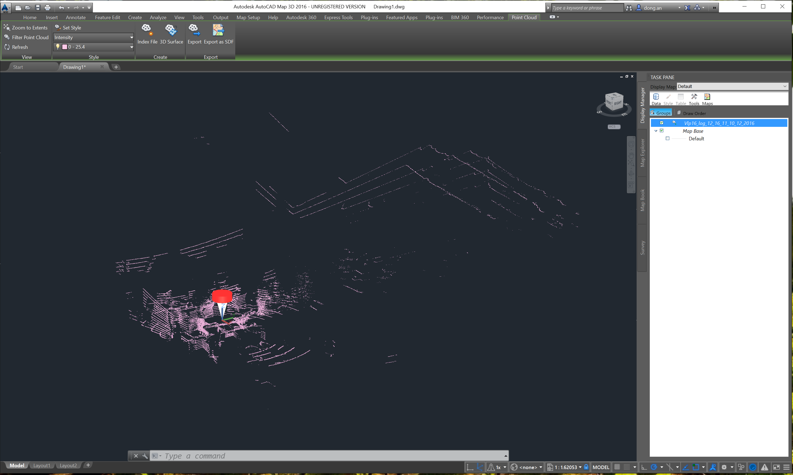

## Introduction

Light Detection and Ranging (LiDAR) systems are approaching the size, weight, and cost to enable payload integrations into small UAS (Unmanned Aircraft Systems). LiDAR is a compelling sensor for commercial UAS applications, such as 3D aerial mapping, surveying, inspection, collision avoidance, and autonomous navigation in both indoor and outdoor environments. In this release, the following API (Application Programming Interface) and API based examples are provided:

- API for supporting the computation of point cloud and logging LiDAR data in real-time  into a standard LAS (LiDAR Aerial Survey) or PCAP (packet capture) file 

- A LiDAR simulator for playing back PCAP files in real-time via the same Ethernet output as a real LiDAR for facilitating development and debugging for the system integration 

- An API based example to demonstrate how to use the API of real-time point cloud computation and LAS/PCAP logging. It can also be used for the use case of the integration of Velodyne LiDAR with M100 without the onboard SDK 

- A DJI onboard SDK example with the capability of a real-time point cloud computaiton and LAS/PCAP logging (Please see [Section "Linux" under Chapter "Sample Applications"](../../github-platform-docs/Linux/README.html))

LAS standard is defined by the ASPRS (the American Society for Photogrammetry and Remote Sensing) for LiDAR data axchange. LAS compilicance allows the LAS data files to be able to be post processed  by many 3D GIS (Geographic Information System) software and LiDAR application software (commercial, free, and open source). The PCAP log files can be post processed with Velodyne's 
<a href="http://www.paraview.org/Wiki/VeloView" target="_blank">VeloView software</a>. This release supports ASPRS LAS versions 1.0, 1.1 and 1.2. 

Figure 1 shows a point cloud map generated by this example integration of LiDAR on an M100.  We use a Velodyne VLP-16 Puck Lite and a powerful Intel i5 based OES in this tutorial to show the integration of DJI onboard SDK with LiDAR data collection.

Figure 1 Point cloud map inside a building from <a href="http://velodynelidar.com/vlp-16-lite.html" target="_blank">Velodyne VLP-16 Puck Lite</a>

## Hardware Setup

The Matrice 100 drone is used for the demonstration. A DC-DC power supply is employed to obtain the power from the onboard battery  for the drone and convert/regulate DC voltage for both i5 based Linux mini computer and LiDAR, as shown in Figure 2 below.

Figure 2 Diagram of Hardware Setup

Table 1 lists the power consumption of the units and capacities of the batteries.

#### DC-DC power supply

  DROK DC Volt Converter Regulator is selected. It has the following specifications:
  	
  Properties: non-isolated step-down power supply module   
  Input voltage: 8-35V   
  Output voltage: 1.5-24V adjustable     
  Output current: 5A MAX, recommended: below 5V,4A long-term; 6-9V, 3A; 10V-15V,2.5A
     
  More information can be found in [Amazon](https://www.amazon.com/DROK-Converter-Regulator-1-5-24V-Adjustable/dp/B00KL7I9XC).

#### Linux mini computer

  "Zini-1660" is the 6th Generation Intel Core i5 Processor based Linux mini computer with the following specifications:

  Linux Version:  Ubuntu 16.04 LTS  
  Processor: i5-6260U 1.8 GHz 2 core, 4 threads (Intel Iris Graphics 540)     
  Memory: 16 GB DDR4-2133     
  Storage: 250GB Crucial M.2 SSD
  Networking  Gigabit Ethernet (included)    
  WiFi  Intel® Wireless AC Dual-Band (2.4/5ghz) (included)    

  More information can be found [here](https://zareason.com/shop/Zini-1660.html).

#### LiDAR

  Velodyne's VLP-16 PUCK LITE is the latest lighter weight/smaller version of the VLP-16 PUCK for the applications with lower weight and small size requirements.  More information can be found [here](http://velodynelidar.com/vlp-16-lite.html).
  	
  
  Figure 3 above shows M100 with the Velodyne, Zini test setup. 

  
  Figure 4 above shows M100 with the Velodyne, Zini test setup in-flight. 
	
## Software Guide

The API and software have been developed and tested with Ubuntu 16.04 LTS.   

#### External Library Dependencies
The software API and example have the following widely used external libary dependencies:   
  PCAP    
  BOOST  
  VTK   
  LIBLAS    
Please note that: pcap needs to be version 1.40 or later.Boost needs to be version 1.50 or later; VTK needs to be version 7.0; and LIBLAS needs to be version 1.2.1-4 or later.

#### Installation of External Library Dependencies  
If the API and examples are built with CMake, the CMake will automatically install the external libary depenencies. However, these libaries can be installed seperately as follows: the binary files of PCAP, BOOST and LIBLAS are available for Ubuntu and can be installed by directly using the following  "apt-get" commands, respectively:

`sudo apt-get update`   
`sudo apt-get install libpcap-dev`     
`sudo apt-get install libboost-all-dev`  
`sudo apt-get install liblas-dev`      

The instructions for building and installing VTK can be found in <a href="http://www.vtk.org/Wiki/VTK/Configure_and_Build" target="_blank">the Visualization ToolKit (VTK) website</a>. 

#### LiDAR Simulator

The LiDAR simulator is located in:   
`./onboardsdk/sensor-integration/velodyne_vlp16puck_lite_API_example/sim`.

The source code does not use any Qt classes. The Qt project file "velodyne_lidar_sim.pro" for compiling with Qt as IDE and "CMakeLists.txt" file for compiling with cmake are provided for building a console application.    

To run the executable "velodyne_lidar_sim", there are 4 arguments needed:  
`./velodyne_lidar_sim   [PCAP file]  [RewindLooping] [DestinationIP]  [packetTobeSent]`  

PCAP file: the LiDAR packet capture file for the simulator to pick up the LiDAR data.  
RewindLoop:  
	1: starting over after the simulator reads the last packet of the file.   
	0: no starting over.  

DestinationIP:   destination IP.    

packetTobeSent:  
	0: the all the packets in the PCAP file will be sent.  
	>=1: the index of the packet to be sent out continuously. For example, if it is set to "1", the first packet will be sent out continuously; if it is set to "2", the second packet will be sent out continuously.   

#### API  
The header files and source code files are located in:
`./onboardsdk/sensor-integration/velodyne_vlp16puck_lite_API_example/vlp16lidar-driver/inc`. 

`./onboardsdk/sensor-integration/velodyne_vlp16puck_lite_API_example/vlp16lidar-driver/src`.

Note that "wrapper.h" is only the header file for the outside world for integration. The API provides a UDP driver and data logging with LAS/PCAP files for integration with OES for the drone.  

#### Example for LiDAR with M100
The example software is located in:

`./onboardsdk/sensor-integration/velodyne_vlp16puck_lite_API_example/pointcloud_grabber`.

The source code does not use any Qt classes. The Qt project file "pointcloud_grabber.pro" for compiling with Qt as IDE and "CMakeLists.txt" file for compiling with cmake are provided for building a console application.

The data is logged into: 
	
`/home/(user)/Vlp16_logfiles/`

The data file is automatically named with the format starting with "vlp16_log_" plus "Hour_Min_Seconds_Month_Date_Year", for example:

`Vlp16_log_17_32_08_07_27_2016.las`  
`Vlp16_log_17_32_08_07_27_2016.pcap`

The executable "pointcloud_grabber" can be run with an optional argument of a log file type, as follows

`./pointcloud_grabber  [logFileType]`

logFileType:  
	0: PCAP file only.      
	1: LAS file only.  
	2: both PCAP and LAS files.
Note that if it runs without any argument, both PCAP and LAS files are logged in real-time.  Logging can be terminated by pressing "CTRL+C",  or "q" ("Q") plus "Enter". Please note that data logging should be terminated before turning off the LiDAR (terminating the LiDAR simulator if the LiDAR simulator is used).

In addition, a xml file "VLP-16.xml" needs to be placed in the same directory of the executable. Currently, a user is not required to do any configuration, calibration, or other setup before VLP-16 LiDAR starts generating valid data after power-up. This file is provided by Velodyne with default values (no acutal corrections on the LiDAR data) for future use cases (for example, a user wants to do a specific calibration for the LiDAR).  
 
Velodyne's VeloView can be downloaded from <http://www.paraview.org/Wiki/VeloView>.  Figure 5 below is the point cloud map of a pcap log file in VeloView.

Figure 5: Point Cloud Map   

There are a lot of 3D GIS Software and LiDAR Application Software available (commercial, free, and open source), such as <a href="http://www.autodesk.com/products/autocad-map-3d/overview" target="_blank">Autodesk AutoCAD Map 3D</a>, <a href="http://www.merrick.com/Geospatial/Software-Products/MARS-Software" target="_blank">Merrick Advanced Remote Sensing (MARS) Software Suite </a>, and <a href="http://www.danielgm.net/cc/" target="_blank">CloudCompare</a>. Figure 6 shows the display of  the point clouds from a LAS file (logged by the example software) in Autodesk AutoCAD Map 3D.

Figure 6: Point Clouds from a LAS file (Autodesk AutoCAD Map 3D)   
#### Example for Integration of DJI Onboard SDK with LiDAR 

The "Linux" example has been updated to incoprate the LIDAR API to provide LiDAR LAS/PCAP file logging capability. (Please see [Section "Linux" under Chapter "Sample Applications"](../../github-platform-docs/Linux/README.html)).
