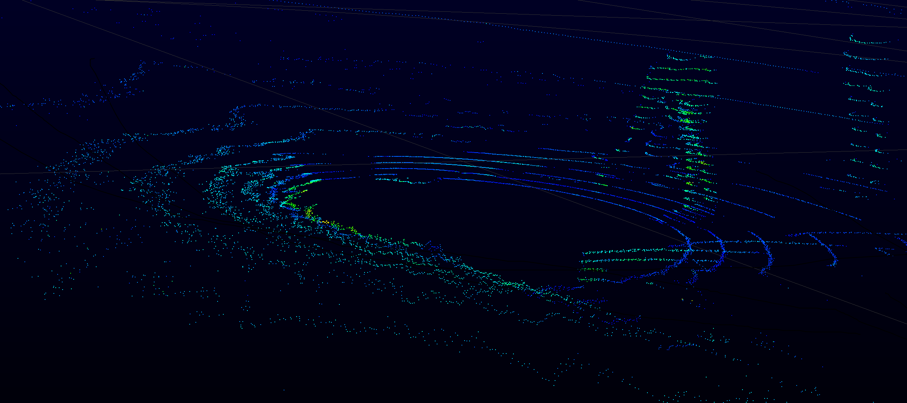
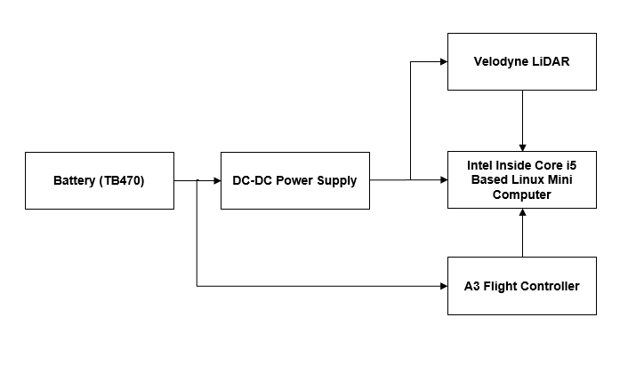
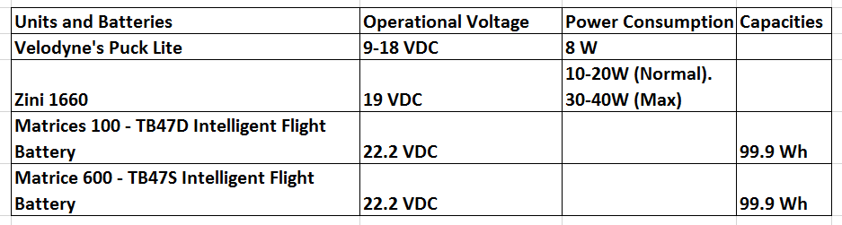

## Introduction

Advances in sensing capability and size and cost reduction of Light Detection and Ranging (LiDAR) have made it natural to consider a LiDAR for GN&C (Guidance, Navigation and Control) of commercial UAV applications, such as mobile mapping, surveying, and inspection. Figure 1 shows a point cloud map inside a building using a Velodyne VLP-16 Puck Lite.  Velodyne VLP-16 Puck Lite is used to demonstrate the potential critical integration of DJI onboard SDK with a LiDAR for an OES (Onboard Embedded System). 

In this release, a preliminary library and example have been developed to support logging real-time data into a standard pcap file.  The pcap log files can be post processed with Velodyne's "VeloView" or other third party's LiDAR data processing and visualization software. 
 
More comprehensive library and examples for further higher level integration are under development for future releases.

Figure 1 Point cloud map inside a building from Velodyne VLP-16 Puck Lite (<http://velodynelidar.com/vlp-16-lite.html>)

## Hardware Setup

Matrice 100 drone is used for the demonstration. A DC-DC power supply is employed to obtain the power from the battery and convert/regulate DC voltage for both i5 based Linux mini computer and LiDAR, as shown in Figure 2 below.

Figure 2 Diagram of Hardware Setup

Table 1 lists the power consumption of the units and capacities of the batteries.

**(1). DC-DC power supply**

  DROK DC Volt Converter Regulator is selected. It has the following specifications:
  	
  Properties: non-isolated step-down power supply module   
  Input voltage: 8-35V   
  Output voltage: 1.5-24V adjustable     
  Output current: 5A MAX, recommended: below 5V,4A long-term; 6-9V, 3A; 10V-15V,2.5A
     
  More information can be found in [Amazon](https://www.amazon.com/DROK-Converter-Regulator-1-5-24V-Adjustable/dp/B00KL7I9XC).

**(2). Linux mini computer**

  "Zini-1660" is the 6th Generation Intel Core i5 Processor based Linux mini computer with the following specifications:

  Linux Version:  Ubuntu 16.04 LTS  
  Processor: i5-6260U 1.8 GHz 2 core, 4 threads (Intel Iris Graphics 540)     
  Memory: 16 GB DDR4-2133     
  Storage: 250GB Crucial M.2 SSD
  Networking  Gigabit Ethernet (included)    
  WiFi  Intel® Wireless AC Dual-Band (2.4/5ghz) (included)    

  More information can be found [here](https://zareason.com/shop/Zini-1660.html).

**(3). LiDAR**

  Velodyne's VLP-16 PUCK LITE is the latest lighter weight/smaller version of the VLP-16 PUCK for the applications with lower weight and small size requirements.  More information can be found [here](http://velodynelidar.com/vlp-16-lite.html).
  	
  
  Figure 3 above shows M100 with the Velodyne, Zini test setup. 

  
  Figure 4 above shows M100 with the Velodyne, Zini test setup in-flight. 
	
## Software Guide
The demo software is located in:

`.\onboardsdk\thirdparty` with two the following subfolders:
`.\onboardsdk\thirdparty\velodyne_vlp16puck_lite_API_example\lidar_APIs_LIB`
`.\onboardsdk\thirdparty\velodyne_vlp16puck_lite_API_example\QtConsoleExample`

The library (`.\onboardsdk\thirdparty\velodyne_vlp16puck_lite_API_example\lidar_APIs_LIB`) provide a UDP driver (based on Boost) and data logging with pcap files. This library can be integrated into OES.  Please note that: Boost needs to be version 1.50 or later; pcap needs to be version 1.40 or later.

The example (`.\onboardsdk\thirdparty\velodyne_vlp16puck_lite_API_example\QtConsoleExample`) provide a Qt console application to use the lib to gather and log data into a pcap file. Please note that Qt needs to be the latest version Qt5.7.

The data is logged into: 
	
`/home/(user)/Vlp16_logfiles/`

The data file is automatically named with the format starting with `vlp16_log_` plus Hour_Min_Seconds_Month_Date_Year, for example:

`Vlp16_log_17_32_08_07_27_2016.pcap`

Velodyne's VeloView can be downloaded from <http://www.paraview.org/Wiki/VeloView>.  Figure 5 below is the point cloud map of a pcap log file in VeloView.

Figure 5: Point Cloud Map
